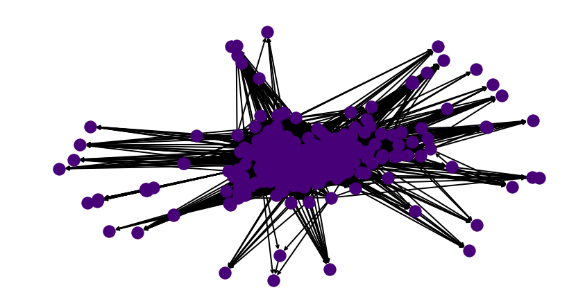
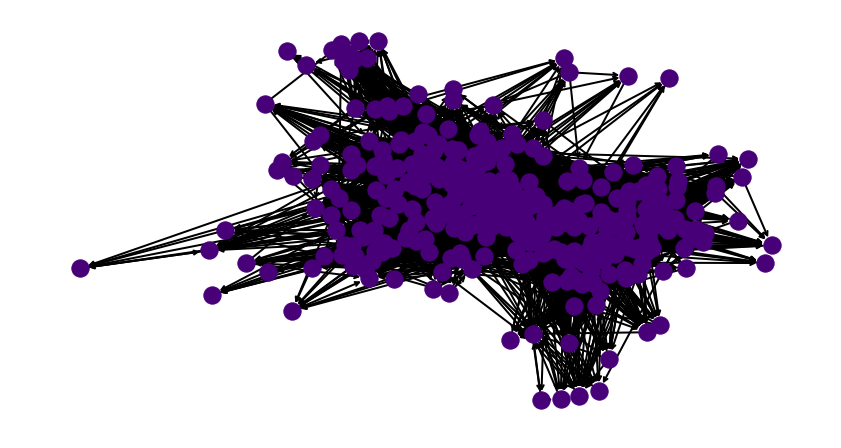
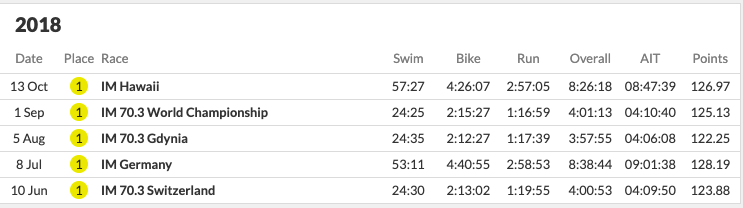

<div class="container">

**DISCLAIMER:** All analysis is done using long course races. We do not expect similar trends to hold for short course. In the off chance they do, that is purely luck! Additionally all analysis is conducted using data from Women's pro races. In our experience, the Men's races follow similar trends. 

# Primo Rank 

Finally getting around to doing this (6 months later).

## What does it mean to have a ranking?

Life is a stochastic process -- there are no certainties in life. It should make sense that triathlon would be no different. The statement athlete $i$ ranked higher than athlete $j$ implies that the probability of $i$ beating $j$ is greater than the the probability of $j$ beating $i$. Equivalently, one could also interpret a ranking as the following, if $i$ is ranked above $j$, $i$ beats $j$ on average. Over the course of this document, we will formalise the above notion into mathematical statements via some sort of statistical model. The reader is reminded of one of the fundamental truths of life: **ALL MODELS ARE WRONG (including this and the current ranking system)! SOME ARE USEFUL** We hope that this way of ranking athletes is useful/fair to some.

## The model

Denote athletes as integers $1, 2, \dots, n$. Let $\gamma_i \in \mathbb{R}$ for all $i \in \{1, 2, \dots, n\}$ denote the quality of an athlete. If $\gamma_i > \gamma_j$, then athlete $i$ is ranked above athlete $j$. We do not know the true values of $\gamma_i$. In fact nobody will ever know. This represents the intangible hidden talent of an athlete that allows them to swim/run/bike very fast. What we can do however, is estimate this value from race results. What we mean by this -- if athlete $i$ keeps beating athlete $j$, and athlete $j$ keeps beating athlete $k$, our model should not rank $k$ above $i$. Note, when we say beats, we mean on average or most of the time. 

We go back to a simple model recommended by Bradley and Terry in 1952 [[1][1]] which simply states

\begin{align*}
P\Big[\text{i beats j} | S \subseteq \{1, 2, \dots, n\} \Big] = \frac{\gamma_i}{\gamma_i + \gamma_j}
\end{align*}

So this is saying that, given a start list of $S$, the probability that say, Lionel Sanders beats Jan Frodeno, just depends on individual talents pitted against each other. It is **independent** of all other athletes $S$ in the race. *Now this is not strictly true. These days there are some really strong bike riders that do a lot of work at the front. A strong runner could sit in, conserve energy and attack later. So the above equation represents a simplifying assumption, it is often made primarily because modelling all possible combinations of athletes between $i$ and $j$ is computationally intractable -- the maths is too hard or it is to specific to generalise. If someone or I come up with better theory to model this, I will write a part II. Note this model is widely used in all avenues of life -- other sport rankings, advertisements, stock markets etc. so it's not that terrible an assumption. As described later in the post, the simple equation above made Google a lot of cash.*

Another way to view the above statement is to decide the outcome of a race by between $i$ and $j$ by flipping a coin, where the probability of seeing heads is $\frac{\gamma_i}{\gamma_i + \gamma_j}$. If we see heads, we declare that $i$ won, and declare $j$ won otherwise. Now if $i$ is a much much better triathlete than $j$ i.e. $\gamma_i \gg \gamma_j$ then the coin would almost always show up as heads.

## Estimating Talent

We have already described how no one can actually measure the quality of a triathlete. So in this section, we write down a model to estimate it from race results. For a given guess of athlete quality, $\gamma = (\gamma_1, \dots, \gamma_n)$, define $l(\gamma)$ as the function that measures how good our guess of $\gamma$ is for each athlete. We define it as the following:

\begin{align*}
l(\gamma) = \sum_{i=1}^n \sum_{j=1}^n \Big[ w_{ij}\ln \gamma_i - w_{ij}\ln(\gamma_i + \gamma_j) \Big]
\end{align*}

$w_{ij}:$ The number of times $i$ beat $j$ in races.

$w_{ii}=0$ Athletes cannot beat themselves.

This weird looking formulae is simply the log likelihood of the model we wrote above. **INSERT MATHS BUTTON** <div class="intuition">The details of what that means are not required to follow the rest of the document. One can think of the function as the following: Say someone gives you some numbers $\hat{\gamma_1}, \dots, \hat{\gamma_n}$ that represent the quality of athletes. This function gives you a measure of how likely it is that these numbers produced the the actual race results we observe, under our simple model. Ideally, we want a set of quality numbers $\hat{\gamma_1}, \dots, \hat{\gamma_n}$ such that they maximise the above function. The function above has the nice property that there exists a unique $\hat{\gamma_1}, \dots, \hat{\gamma_n}$ that maximises it. </div><br>


Since $l(\gamma) = l(\alpha\gamma)$ for $\alpha > 0$, the parameter space should be regarded as the set of equivalence classes of $R_+^n$, where two vectors are equivalent if one is a scalar multiple of the other. This is most easily accomplished by putting a constraint on the parameter space; to this end, we assume that $(\sum_{i=1}^n \gamma_i) = 1$ <div class="intuition">This is a complicated way of saying, we will find quality scores such that they all sum to 1. Consider the toy example of 3 athletes all equally good. Then the scores for all would $\frac{1}{3}$</div>


<div class="important">
<h4>Caveat:</h4>
The above maximisation does not always have a unique. To get the nice quality scores we spoke about we need the set of results to have a nice property. **In every possible partition of the individuals into two non empty subsets, some individual in the second set beats some individual in the first set at least once.**
Put another way, if we connected a graph where each athlete was a node, and a directed edge from $i$ to $j$ is formed if $i$ beat $j$ in a race, then we need the graph formed by all races in a season to be strongly connected. **Side story:** *A slight variant of the above model is how Google discovered which pages they should add to their search engine first, when they fist started. They too needed to rank things. So triathletes are encouraged to consider that, this dumb coin flipping game was Googles page rank algorithm. We all know how Google turned out - and its evidence that often simple models are very powerful.*

<h4>Why is this important:</h4> 
In the first part of this series we referenced how scarcely athletes race each other. If races are bubbled or live in geographical isolation -- it is impossible for us to rank athletes meaningfully even with this simple model. Thus when the PTO organises events they should keep in mind that the minimum requirement from their events is to get a connected graph of athletes. **Attention PTO:** Or in other words, the smarter the race schedule, the less controversy there is in ranking and comparing triathletes.
</div>
<br>
For the year of 2018, there were $135$ 70.3 or IM professional races that involved 1 or more pro women triathletes. Below we visualise what a connectedness graph looks like. Each node is an athlete. An directed edge between one node from the other indicates that source node beat the destination node in a race i.e. finished above them in a race.

</img>

The nodes that you see on the fringes are athletes that showed up to one or two races and were beaten by most. Such athletes typically cannot be ranked in any meaningful way without having another race that pits them against each other. This does not really impact the final goal of this post -- which is to come up with a ranking system for the top athletes. We focus on the top athletes because their pay is affected by their ranking (and Collins cup positions etc.) Someone like me could be the $100,101$ best triathlete in the world or $100,121$st. It does not really matter.


### Check for connectedness/plausibility

In this section we look at triathlon races in the past and see how many of the race calendars were connected. **Note:** If a race year is not connected we cannot actually rank athletes meaningfully. In case a race calendar is not connected, we will use the largest connected component of the graph. <div class="intuition">We will only use athletes that race frequently enough and in meaningful races. Colloquially, only those athletes that race in competitive fields and often will get professional ranks. This prevents me from rocking up to my local park and creating my own triathlon, winning it and boosting my world rank.</div>

There is an exception to this rule: In triathlon, we often have punters like Jan Frodeno and Gustav Iden -- who never lose (even the meaningful races). Mathematically, no node in the graph can get to them. If this happens we will need an axillary heuristic method to decide between these athletes. 

2020 was a year of the pandemic -- so we do not include it in our analysis as it does not represent normal times. Our goal is to rank athletes in normal times not in the middle of pandemic. We argue that during a pandemic there are more important things to do - and rest our case.

We compiled all races for the following races and found that the graphs were not strongly connected. This implies that there some pro athletes to whom we cannot assign a ranking as they have not raced enough or won in strong enough fields for the algorithm to confidently assign a value. Shown below is the output of our little Python3 script.

```
Getting races for year: 2017
Number of races for year 2017 : 155
Pre-prcoessing
Number of races for year 2017 : 139

Getting races for year: 2018
Number of races for year 2018 : 152
Pre-prcoessing
Number of races for year 2018 : 135

Getting races for year: 2019
Number of races for year 2019 : 148
Pre-prcoessing
Number of races for year 2019 : 129

Getting races for year: 2021
Number of races for year 2021 : 92
Pre-prcoessing
Number of races for year 2021 : 79

2017
IS GRAPH CONNECTED:  False
2018
IS GRAPH CONNECTED:  False
2019
IS GRAPH CONNECTED:  False
2021
IS GRAPH CONNECTED:  False

```

Our only option now is to consider the largest connected components in this graph. In subsequent posts we can find ways of including such athletes by making relaxed assumptions about how an athlete compares with another (something everyone can beat anyone with some small random probability, but that would imply even I could be considered to be PRO and with infinitesimally small probability have the chance of beating Jan.) For the year of 2018, if we drop 51 athletes from the rankings, then we get a strongly connected sub-graph over which we can compute quality scores. Shown below is the sub graph.

</img>

These are the athletes that [can](./pngs/made_it_2018.json) get rankings. These are the ones that [cannot](./pngs/missed_out_2018.json)

Remember when we said there is an exception to the rule for throwing out athletes. The super winning athletes will get thrown out in a connected components search. Well that's what happened. The year is 2018, and Daniela Ryf did not lose any race and she raced a lot! A very impressive athlete and a pain in a statisticians neck, this can be easily remedied. She gets a ranking of 1. We just offset everyone else race rank by 1 to accommodate this. In that year she was literally *in a league of her own*.

</img>


## The solution

We have a strongly connected sub graph and we have race results. It's time to estimate the quality scores. The derivation for how to do this is beyond the scope of this document. But for the interested reader we have re-derived it below. We did not invent the solution. These smart people [[2][2]] did.


# References

[1]: https://www.jstor.org/stable/2334029?origin=crossref "Rank Analysis of Incomplete Block Designs: I. The Method of Paired Comparisons"
1. [Rank Analysis of Incomplete Block Designs: I. The Method of Paired Comparisons](https://www.jstor.org/stable/2334029?origin=crossref)

[2]: https://projecteuclid.org/journals/annals-of-statistics/volume-32/issue-1/MM-algorithms-for-generalized-Bradley-Terry-models/10.1214/aos/1079120141.full "MM ALGORITHMS FOR GENERALIZED BRADLEY–TERRY MODELS"
2. [MM ALGORITHMS FOR GENERALIZED BRADLEY–TERRY MODELS](https://projecteuclid.org/journals/annals-of-statistics/volume-32/issue-1/MM-algorithms-for-generalized-Bradley-Terry-models/10.1214/aos/1079120141.full)

</div>
