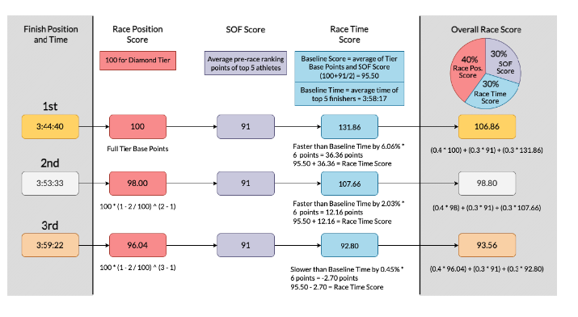

<div class="container">
<div class="important"> 

**<u>Disclaimer</u>**: I am not an athlete nor can I claim to be a
hardcore triathlon fan. I am not directly affected by the outcome of
different ranking strategies, financially or spiritually. My interest
in the problem is purely from an algorithmic game theory
standpoint. Ranking strategies often lead to pathological behaviours
([see](https://youtu.be/TM_QFmQU_VA?t=494) for an
example). Understanding and analysing the mathematical underpinnings
of such behaviour is a personal research interest. Note as these
systems represent rank actual people with feelings and were developed
by a different set of humans (also with feelings), I have tried to
remain as neutral as possible in my discourse. In the off chance
someone is offended, I apologise.  </div>

## Recap 

In 2020, the PTO deployed a system for ranking triathletes which many
perceived to be complicated and
unfair[^1]. [See](https://abiswas3.github.io/sportsMaths/ProblemStatement/index.html)
for a refresher. At the heart of this ranking malarky lies a simple
question -- "How do you compare the performance of two athletes who
did not race each other on the same day?". One cannot sort two
performances by finish time as they vary across courses. The problem
is not unique to triathlon either. This question has plagued social
choice theory since the 1950s, so it's unlikely any proposed solution
will resolve all outstanding issues. Similar measurement issues arise
in marathon running, tennis, chess, golf and many other sports. Thus,
the PTO employed a committee of athletes, who after a year of
discussion and deliberation, came up with a new system that resolves
this question in fair manner. A key motif behind doing over the old
system was to simplify how ranking points were calculated and to
re-align the rankings to better represent the athlete values.. [A
clear description of the new system can be found
here](https://protriathletes.org/pto-world-ranking-system/) and thus
there is no need to go over the details again.


[^1]: Searching for PTO rankings on Twitter should 


At this point, as far as the PTO is concerned, this ranking problem
appears solved. The athletes were affected by the rankings, and they
decided to devise a system that prioritised their interests. The
people decided for the people, and democracy won and as Bernard Shaw
famously stated -- "Democracy is a device that ensures we shall be
governed no better than we deserve." Thus this manuscript, unlike its
predecessors does not try to propose an alternate system. It simply
tries to model the consequences of such a system. The remainder of
this document is written from the perspective of an imaginary
triathlete Bob, who isn't that great at swim, bike or run. However,
much like his namesake[^2], Bob will look to lie and cheat to find
ways to boost his ranking. In other words, what is the maximum
triathlon ranking Bob can get without actually investing any time in
being good at triathlon? 

<!-- The hope is that the search for Bob's strategies will highlight the -->
<!-- pathological tendencies of the new ranking system. It should not be -->
<!-- read as a critique of the current system. All ranking systems (even -->
<!-- provably optimal ones) lead to unavoidable social -->
<!-- situations. Typically a group of humans will look at the odds of that -->
<!-- situation arising and accept it as an unavoidable risk. Bob's attacks -->
<!-- might be shown to be improbable, and that should strengthen the trust -->
<!-- in the new system. -->

[^2]: [Lies, God-damned lies and Bob Dylan](https://www.thedailybeast.com/bob-dylan-why-we-can-never-know-him)

## The New System

From the outset it would appear that the new system considers a
diverse set of facets of a race and then weight them to compute a
final score. However, closer examination of the point system reveals
that the new system is really based around one central concept -- the
committees' definition of strength of field. There are 3 ways to
accumulate points during a triathlon race, namely:

+ **Finishing higher up in big races** -- akin to how winning the
  Olympic gold should matter more than winning your local park
  run. The Bigness of a race is determined by the athletes, race
  organisers and how much cash is up for grabs. There are five types
  of races, each with a base score and a drop-off rate. Let $b$ be the
  base score and $r$ be the drop off rate for a type of race. Then the
  winner gets $b$ points, the next athlete is $r\%$ lower than the
  person ahead of them. The group scores are as follows:
	+ Diamond: (100, 2)
	+ Platinum: (95, 2)
	+ Gold: (90, 5)
	+ Silver: (80, 8)
	+ Bronze (70, 11)


+ **Race the best to be the best** -- Each race has a strength of
  field (SOF) score which is meant to reflect hardness to win. The
  higher the SOF the harder it is to win this race. Regardless of your
  final race position, if you took part in this race, you get an
  additive offset of $0.3*SOF$ added to your final score. The SOF
  score is just the average of the PTO rank score for the top 5
  athletes that start the race.
  
+ **Finishing unreasonably quickly should be rewarded** -- Finish time
  is not a reliable metric in comparing across different races. Wind,
  road surface, rain, heat, hills are some of the miscellaneous
  factors that act as counterfactuals that bias time. However, if you
  ask athletes, they'll often tell you words like *"That's a really
  fast time for this course"*. So, very believably, they have
  instinctive feel for what is fast or a superhuman performance. They
  would like to reward an athlete for such a performance. They do so
  by calculating how much faster (or slower) an athlete went from a
  base time (quite similar to AIT) as a percentage. So if the base
  time was 100s and I complete the race 104s. Then I went 4% faster
  and for every 1% I went faster I get an additional 6 bonus points on
  top of the baseline points.

Finally they take the score from each category and add them up with
different weights. Shown below is a screen grab from [this
article](https://www.triathlete.com/culture/news/new-2023-pto-rankings-revealed-dissected/)
which goes over the arithmetic.



<!-- PS: There is a harmless arithmetic error in the [PTO Website -->
<!-- description](https://protriathletes.org/pto-world-ranking-system/) -->

<!-- ``` -->
<!-- An athlete’s final Race Time Score is calculated by starting with the Baseline Score and adding or deducting 6 points for every 1% that they’re faster or slower than the Baseline Time. An athlete’s Race Time Score cannot fall below 0 regardless of how far behind the Baseline Time they finish a race -->
<!-- ``` -->

<!-- And then they work out an example: -->

<!-- ![[pngs/Screenshot 2023-02-17 at 12.12.22.png]] -->

<!-- $Base = 3:58:17$ -->
<!-- First finisher $= 3:44:40$ -->

<!-- They are faster than baseline should be  $\frac{| Base - finish|}{Base}$ but instead $\frac{| Base - finish|}{finish}= 6.06\%$. The error is harmless as everything is linear, and it shouldn't matter that much :-)   -->

## The weights do not matter

As previously stated, although the final score is a mixture of three
different features, the three features are highly correlated. This
implies that only one feature really matters -- strength of field.

To see why Feature 1 (Tier of a race) and Feature 2 strength of field
are correlated is easy. The tiering of a race is based on prize money
and prestige, and thus the best athletes end up racing those races. 

The figure below plots the tier on the Y-axis and the SOF on the
X-axis. It is easy to see that the two are positively correlated. For
a fixed tier, one might observe that the SOF has enormous variance (we
will get to this later) but if you do well in a high tiered race, you
will almost always do well in the SOF category as well.


Feature 3 is supposed to reward an athlete based on the difference
between their time and the time of the top finishers. Let $\Delta$
represent this time difference[^3]. The final score is calculated as
$0.3(B + \Delta)$, where $B = (Tier + SOF)/2$ where $Tier$ is the tier
points awarded to the winner of the race. Note $B$ has nothing to do
with your acutal performance. $B$ is determined even before the race
starts.

Thus the final score $S$

\begin{align}
S &= 0.4\times Tier + 0.3\times SOF + 0.3(B + \Delta) \\
&= 0.4\times Tier + 0.3\times SOF + 0.3((Tier + SOF)/2 + \Delta) \\
&= 0.4\times Tier + 0.3\times SOF + 0.15\times Tier + 0.15\times SOF + 0.3\times\Delta \\
&= 0.55\times Tier + 0.45\times SOF + 0.3\times\Delta
\end{align}

[^3]: More specifically, $\Delta$ is the fraction the athlete was off from the averagae performance of the top 5 athletes times 6.

Based on the figure above, we could just replace Tier with SOF and not
much would change. Now we know that for high tier/sof races the drop
off rate is much kinder to athletes that finish later. As mentioned
earlier, finishing 12th and winning can be the same.

Going back toour imaginary character Bob -- it is a complete waste of
time for Bob to do any races that are not the big PTO races or
championship races. The only feature that is not affected[^4] by the
SOF factor of a race, contributes to about 20\% of your score and that
. Observe the plot below which shows $\Delta$ (X-axis) as a function
of race finish position (Y-axis).

[^4] : Directly affected. It is incredibly likely that high SOF races
will create large negative gaps in delta for slightly weaker
athletes. But it is not an explici feature of the model.

Note that $\Delta$ really accoutns for about
$22\%$ of your score. That seems reasonable right? Most of the score


</div>
