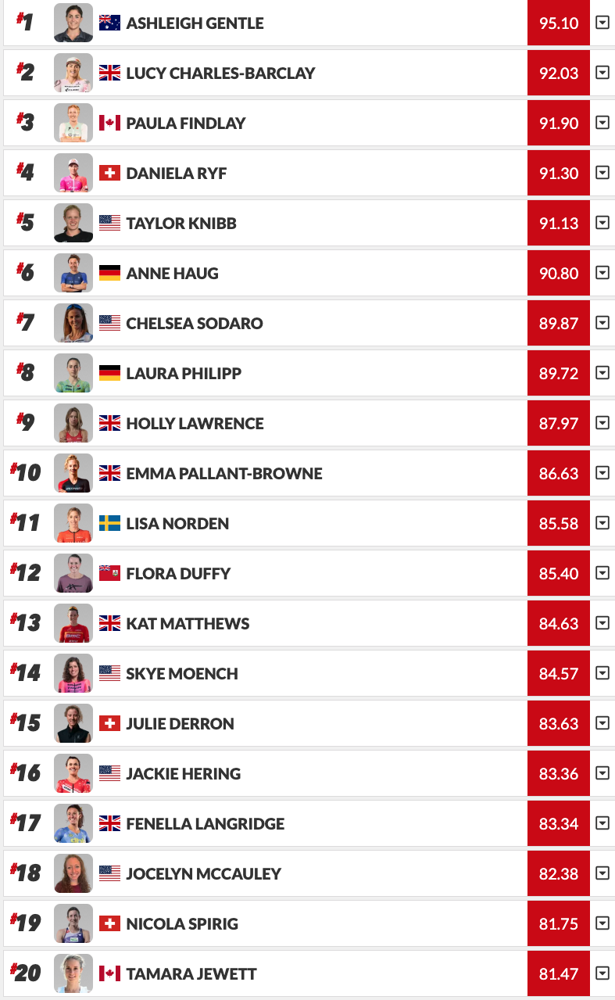

<div class="container">
<div class="important"> 

**<u>Disclaimer</u>**: I am not an athlete nor can I claim to be a
hardcore triathlon fan. I am not affected by the outcome of different
ranking strategies, financially or spiritually. My interest in the
problem is purely from an algorithmic game theory standpoint. Ranking
strategies often lead to pathological behaviours
([See](https://youtu.be/TM_QFmQU_VA?t=494) for an example). Thus
understanding the mathematical properties of a ranking system is our
best best to uprevent/understand/anticipiate such behaviour.  If I use
an athlete as an example, I do not actually know the athlete -- I am
going just by the numbers. I have tried to remain as neutral as
possible, but in the off chance someone is offended, I apologise.

</div>

## Recap 

In 2020, the PTO deployed a system for ranking triathletes perceived to be complicated and unfair. See Twitter rants here and some data viz here.  
+ Reece
+ 
Sometime in 2023, a committee of athletes came up with a new system that they deem much fairer. 

At the heart of this ranking malarky lies a simple question -- "How do
you compare the performance of two athletes who did not race each
other on the same day?". Unfortunately, this question has plagued
social choice theory since the 1950s, so it's unlikely any proposed
solution is likely to cure all illnesses. Similar measurement issues
arise in marathon running, tennis, chess, golf, and video games.

By and far, the biggest complaint about the old system was that it
needed to be more complex than necessary -- and athletes could not
strategise their race calendars to maximise ranking points. In
addition, the old system was retrospective -- the points awarded in a
race could only be calculated after race completion. Thus athletes
would finish a race, think they performed really well (or poorly), and
often the rankings would reflect a different story. There were other
issues too, but they have already been discussed in detail
[here](). It should be noted that the new system is still partially
retrospective but we will get to that shortly.

## The New System

The new system is as simple as a ranking system can be. It involves
fractions, addition and multiplication. The committee wanted to reward
athletes for three things precisely (based on my understanding, I did
not talk to the committee, so I apologise if I am incorrect). The
final score is an additive mixture of 3 features, namely:

+ **Finishing higher up in big races** -- akin to how winning the
  Olympic gold should matter more than winning your local park
  run. The Bigness of a race is determined by the athletes, race
  organisers and how much cash is up for grabs. There are five types
  of races, each with a base score and a drop-off rate. Let $b$ be the
  base score and $r$ be the drop off rate for a type of race. Then the
  winner gets $b$ points, the next athlete is $r\%$ lower than the
  person ahead of them. The group scores are as follows:
	+ Diamond: (100, 2)
	+ Platinum: (95, 2)
	+ Gold: (90, 5)
	+ Silver: (80, 8)
	+ Bronze (70, 11)

[The PTO
Website](https://protriathletes.org/pto-world-ranking-system/) draws a
nice table showing how the finish positions compare across
tiers. According to the athlete committee finishing 1st in a silver
tier race is the same value as coming 12th in Diamond league race.


+ **Race the best to be the best** -- Each race has a strength of
  field (SOF) score which is meant to reflect hardness to win. The
  higher the SOF the harder it is to win this race. Regardless of your
  final race position, if you took part in this race, you get an
  additive offset of $0.3*SOF$ added to your final score. The SOF
  score is just the average of the PTO rank score for the top 5
  athletes that start the race.
+ **Finishing unreasonably quickly should be rewarded** -- Finish time is not a reliable metric in comparing across different races. Wind, road surface, rain, heat, hills are some of the miscellaneous factors that act as counterfactuals that bias time. However, if you ask athletes, they'll often tell you words like *"That's a really fast time for this course"*. So, very believably, they have instinctive feel for what is fast or a superhuman performance. They would like to reward an athlete for such a performance. They do so by calculating how faster (or slower) an athlete went from a base time (quite similar to AIT) as a percentage. So the base time was 100 and I went 104. Then I went 4% faster and for every 1% I went faster I get an additional 6 bonus points on top of the baseline points. 

Finally they take the score from each category and add them up with
different weights. Shown below is a screen grab from [this
article](https://www.triathlete.com/culture/news/new-2023-pto-rankings-revealed-dissected/)
which goes over the arithmetic. What's important to remember is the
numbers like (100,2) and top 5 and 6 points are parameters of their
ranking system. The choice of these parameters will matter.


![[pngs/Screenshot 2023-02-17 at 12.04.48.png]]

PS: There is a harmless arithmetic error in the [PTO Website
description](https://protriathletes.org/pto-world-ranking-system/)

```
An athlete’s final Race Time Score is calculated by starting with the Baseline Score and adding or deducting 6 points for every 1% that they’re faster or slower than the Baseline Time. An athlete’s Race Time Score cannot fall below 0 regardless of how far behind the Baseline Time they finish a race
```

And then they work out an example:

![[pngs/Screenshot 2023-02-17 at 12.12.22.png]]

$Base = 3:58:17$
First finisher $= 3:44:40$

They are faster than baseline should be  $\frac{| Base - finish|}{Base}$ but instead $\frac{| Base - finish|}{finish}= 6.06\%$. The error is harmless as everything is linear, and it shouldn't matter that much :-)  

## Meet Bob

At this point, as far as the PTO is concerned, this ranking problem
appears solved. The athletes were affected by the rankings, and they
decided to devise a system that prioritised their interests. The
people decided for the people, and democracy won and "Democracy is a
device that ensures we shall be governed no better than we deserve."
-- GB Shaw.

So the remainder of this document is written from the perspective of
an imaginary triathlete Bob, who cannot swim, bike or run. However,
much like his namesake, Bob loves lying and cheating, and will look to
come up with strategies to manipulate the new system. In other words,
what is the maximum triathlon ranking Bob can get without actually
investing any time in being good at triathlon? The hope is that the
search for Bob's strategies will highlight the pathological tendencies
of the new ranking system. It should not be read as a critique of the
current system. All ranking systems (even provably optimal ones) lead
to unavoidable social situations. Typically a group of humans will
look at the odds of that situation arising and accept it as an
unavoidable risk. Bob's attacks might be shown to be improbable, and
that should strengthen the trust in the new system.

### Immediate Thoughts

Mathematically, the final score for an athlete for a race is a random
variable determined as a function of some random process and model
parameters. Without looking at any numbers or drawing any pictures a
few things stand out.
+ It's a mixture of 3 features but features 1 and 3 are very very correlated (so they are essentially the same feature). 
+ Feature 2 is a constant offset with no in-race discriminatory power. All people in a hard race get the same constant. 

My first thought is all attacks will be related to the one golden rule
of STATS 101

```
Report the mean for the show, but calculate the spread for the dough. 
```

### Sensitivity 

First, we need to understand the idea of the sensitivity of a ranking
system. Sensitivity is closely related to the robustness of
rankings. If Bob can do very little work to get two more points, and 2
points actually make a lot of difference in his rank, then the system
is highly sensitive to perturbations or is not robust. Shown below are
the ranking scores for the top 20 women. If Taylor gets 2 points, she
jumps 4 places to second. My guess is we would want Taylor to perform
really well to climb these four spots. What we don't want is for her
to be able to get 2 points by doing no extra work. With that we get to
Bob's first attack.


## Bob and his freebies

Under the new system, there are points available to Bob that require him to just buy a plane ticket. During the race, Bob can stop for a coffee break, scout for picnic spots and eat his favourite sandwich and still be awarded a meaningful amount of points. You might think only $\frac{30}{100}$
of his final points but it's actually a lot more than just his SOF points. 


## The Social Perceived Fairness of SOF




At the start of the year, any race with Ashleigh, Lucy, Paula, Daniela
and Taylor is the maximum SOF score available in a race. If Anne Haug
decided to also do this race, she has no agency whatsoever to
influence the SOF points available in this race.

This might appear like a big deal but in this situation, it will
likely not matter. As the difference between Taylor and Anne is less
than 0.5; it's almost identical to swap the two of them. But this
might not always be the case. So a natural question is:

```
Q: What is the natural variation of SOF in races in the same band? 

A: If the variance of this statistic is very high, then it allows racers to jump rankings out of pure random chance. For example, if say the standard deviation is like 7, then in the same band of races there are 0.3*7=2.1 points to be gained or lost by random chance on average. 
```


Rewarding athletes by the strength of the field is a perfectly reaso


</div>
