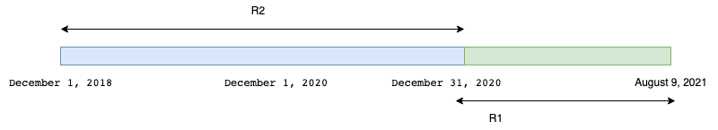

---
title: "Collins cup score"
...

<div class="container">
# How to Collins Cup

The extract below is quoted from the [PTO
Website](https://stats.protriathletes.org/points). A more detailed
explanation can be found
[here](https://protriathletes.org/the-pto-world-rankings-explained/)

```Until the completion of the Collins Cup on August 28, the PTO World
Rankings shall be determined by averaging the World Ranking Points
earned by an athlete from the highest two of (i) any races completed
between December 1, 2020 and before August 9, 2021 and (ii) the
average of the Athlete’s best three races for from December 1, 2018
and December 31, 2020.```

An example worksheet provided by the
[PTO](https://content.protriathletes.org/content/Special-Collins-Cup-Qualification-Protocal-APRIL-FINAL.pdf).
Put simply, there are two time frames $R1$ which considers recent
races and $R2$ which considers old races. Visually the time frame
looks like this:

</img>


Now whover came up with these time frames must have not noticed that
they have a common intersection. Now if someone races in that
intersection, does that race go to $R2$ bucket or the $R1$
bucket. Depending on which bucket it goes to, the final score
changes. See example below.

## When you race in the red box

Meet George Goodwin. (Disclaimer: I do not know Mr Goodwin, Mr Goodwin
certainly does not know me and he did not ask me to this but his
profile fits the confusion)

George raced an event called Challenge Daytona on December
6th, 2020. That is in the red zone. How should we use this race to
calculate his score?

</img>


### Assuming R2

If we assume that this race is R2, then the picture above looks a
little this.

</img>

The average of his best 3 results in R2 is $(96.34+ 89.88 + 88.19)/3
= 91.47$

The collins cup score is now $(91.47 + 62.11)/2 = 76.79$

## Assuming R1

If we assume that this race is R1, then the picture above looks a
little this.

</img>

The average of his best 3 results in R2 is $(89.88 + 88.19 + 77.91)/3
= 85.32$

The collins cup score is now $(85.32 + 96.34)/2 = 90.83$

The website reports the score as 

</img>

Thus it would seem the last figure is the accurate model for dividing
time and not the one reported in the instructions.

Thus it would seem that the actual dates are 

```Until the completion of the Collins Cup on August 28, the PTO World
Rankings shall be determined by averaging the World Ranking Points
earned by an athlete from the highest two of (i) any races completed
between December 1, 2020 and before August 9, 2021 and (ii) the
average of the Athlete’s best three races for from December 1, 2018
and December 1 (not 31), 2020.```

</div>
