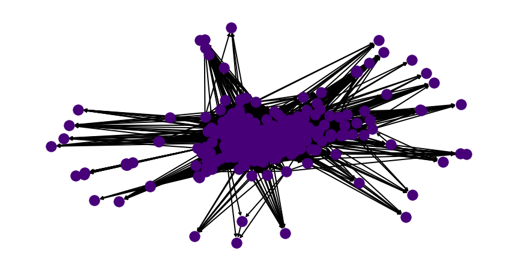

<div class="container">

**DISCLAIMER:** All analysis is done using long course races. We do not expect similar trends to hold for short course. In the off chance they do, that is purely luck! Additionally all analysis is conducted using data from Women's pro races. In our experience, the Men's races follow similar trends. It has been pointed out by experts that 70.3 and IM should not be compared but since the PTO does compare the two of them on the same scale -- we are left with no choice but to compare them on the same scale.

<div class="important"> 

**<u>One very important disclaimer</u>**: I am not an athlete nor can I claim to be a hardcore fan. I am not affected by the outcome of different ranking strategies, financially or spiritually. If I use an athlete as an example, I do not actually know the athlete -- I am going just by the numbers. I have tried to remain as neutral as possible, but in the off chance someone is offended, I apologise. The same goes for the original creators of PTO ranking. I do not think I could write this post without them downloading all race results and putting it one place for me to download. It's harder to build something from scratch than to improve one tiny piece of it. The good news is, I have no followers on any social media platform, thus this post will never go viral. Your reputation is safe. I also make a lot mistakes in spelling, grammar and code and sometimes prove things incorrectly-- so do not trust everything I say. I believe that the people affected in triathlon i.e. those with skin in the game should really decide what behaviour should be rewarded in triathlon. 

</div>

This document can be viewed as an example of how one can model a system of values, and get a principled ranking out of it. *For some it maybe read as a tutorial for generalised linear models*. Read it as you please.


# Part III - Primo Rank 

Finally getting around to doing this (6 months later). 

A few months back I looked into ranking professional long course triathletes and analysed the [existing system](../ProblemStatement/). There were general public complaints about the system from professional athletes, which we mostly ignored while doing our analysis, for fear of being biased by certain views. The major issues with the current PTO setup can be summarised as follows:

* There seems to be no clear reasoning behind using AIT (or expected time). There is no mention of the modelling assumptions behind using such a formula. This can have adverse outcomes as described in detail in earlier posts. The official website can be quoted as describing the system as ```Based on proprietary analysis of historical data developed by and exclusively licensed from TriRating.com, the PTO has ranked each Eligible Race and determined the theoretical ideal time (the “Ideal Time”) that the top ranked athlete would achieve on the course.``` Proprietary and secret algorithms are not very satisfying, as they lacks transparency, which almost always erodes trust in the sport. Not only was the algorithm somewhat mysterious, we also found that it was penalising athletes when they actually win races. For a more detailed analysis refer to the original blog posts.

* The other issue with proprietary, is that no one knows how strategise a race calendar to get paid. According to the [PTO website](https://protriathletes.org/points).```The PTO World Ranking System measures consistent excellence and will be used to determine the year-end bonuses payable to PTO Professionals. The qualifications for the 2021 Collins Cup shall be governed by the special 2021 Collins Cup```. Triathlon is a spectator sport; if an athlete themselves cannot figure out the outcome of winning prior to the race, a spectator cannot as well. 

* Finally, the whole process is based on finish time which is course adjusted in some inexplicable way. Athletes race to beat each other. How much someone beats someone by is relatively immaterial. This phenomenon becomes especially irrelevant when we compare races on courses in different parts of the world with non overlapping start lists.


We recommended a [heuristic based algorithm](../TommyRank/) earlier that was based purely on intuition. There was no mathematical justification of why we choose it - but it was simple to understand, difficult to game and easy to strategise for. The general idea for the heuristic that was there are many bands of races. Ones with good athletes, and lower ones with not so good ones. Winning races in higher bands should be of greater value. In this document we address the lack of rigour of our previous post. This system is roughly based on a simple concept -- ```racers race each other, and if you beat me a lot, you should not be ranked ahead of me. You would also be ranked ahead of Bob and Alice if I beat Bob and Alice and you beat me.```

The first part of the document might appear mathematically terse but the reader is encouraged to motor through. Detailed understanding of each equation is not required. We have tried to write this document such that, each maths section is followed by section written in plain English, describing roughly what the equation mean. For completeness and transparency we include all the theorems and simulation code. The dis-interested reader can ignore this as it does not take away from the general message. The reader can email me at any time with questions or a furious rant refuting my claims.

## What does it mean to have a ranking?
Before we start talking about triathlon, lets revisit what it means to rank athletes. The PTO website uses a more grandiose description for their algorithm ```The World Ranking System of The Professional Triathletes Organisation (the “PTO”) is designed to identify and rank the world’s greatest triathletes who participate in professional non-drafting triathlons``` We will stick with simpler language that's actually measurable. The statement athlete $i$ is ranked higher than athlete $j$ implies that the probability of $i$ beating $j$ is greater than the the probability of $j$ beating $i$. Equivalently, one could also interpret a ranking as the following, if $i$ is ranked above $j$, $i$ beats $j$ on average. Over the course of this document, we will formalise the above notion into mathematical statements via some sort of statistical model.

<div class="intuition">That is just saying, we will write down formulae for how this probability is calculated and average over what specific distribution.</div> The reader is reminded of one of the fundamental truths of life: **ALL MODELS ARE WRONG (including this and the current ranking system)! SOME ARE USEFUL.** We hope that this way of ranking athletes will appear useful/fair to most. 

The good news is, if it does not, we will know exactly why. For a process that pays for athlete livelihood, we argue that knowing why things are not aligned is important. If our modelling assumptions were incompatible with reality - we can change them so they reflect the values of the athletes in the sport.


## The model

Instead of names like Lucy and Daniela we will use integers to describe them. Denote athletes as integers $1, 2, \dots, n$.  Let $\gamma_i \in \mathbb{R}$ for all $i \in \{1, 2, \dots, n\}$ denote the quality of an athlete. If $\gamma_i > \gamma_j$, then athlete $i$ is ranked above athlete $j$. We do not know the true values of $\gamma_i$. In fact nobody will ever know. This represents the intangible hidden talent of an athlete that allows them to swim/run/bike very fast. What we can do however, is estimate this value from race results. What we mean by this -- if athlete $i$ keeps beating athlete $j$, and athlete $j$ keeps beating athlete $k$, our model should not rank $k$ above $i$. Note, when we say beats, we mean on average or most of the time. 

<div class="intuition">The current systems estimate $\gamma_i$ is the final tally of points shown on the PTO website.</div>

We go back to a simple model recommended by Bradley and Terry in 1952 [[1][1]] which simply states

\begin{align*}
P\Big[\text{i beats j} | S \subseteq \{1, 2, \dots, n\} \Big] = \frac{\gamma_i}{\gamma_i + \gamma_j} \tag{1}\label{model}
\end{align*}

All the above equation is saying that, given a start list of $S$, the probability that say, Lionel Sanders beats Jan Frodeno, just depends on individual race quality number pitted against each other. It is **independent** of all other athletes $S$ in the race. *Now this is not strictly true. These days there are some really strong bike riders that do a lot of work at the front. A strong runner could sit in, conserve energy and attack later. The likelihood of the runner beating others is a function of who is also racing. So the above equation makes the simplifying assumption of independence. Such avenues are made in statistics primarily because modelling all possible combinations of athletes between $i$ and $j$ is computationally intractable -- the maths is too hard or it is to specific to actually model (risk of over fitting). 
If someone or I come up with better theory to model this, I will write a part II.*

The above model might appear simplistic. To justify that it is a reasonable model to start comparing, we cite all the other places where something very similar is used. In general if a method is robust across many walks of life, it is likely to be stable for your problem.

1. [Chess](https://www.sciencedirect.com/science/article/abs/pii/S0167268120303838)
2. [Connection between Googles page rank algorithm and Bradley Terry Models](https://selbydavid.com/2016/12/02/ima-poster/)
3. [Multinomial version of BTM and Page rank](https://papers.nips.cc/paper/2015/file/2a38a4a9316c49e5a833517c45d31070-Paper.pdf)
4. [Optimising search engine results ranking](https://www.microsoft.com/en-us/research/publication/semi-supervised-learning-to-rank-with-preference-regularization/?from=http%3A%2F%2Fresearch.microsoft.com%2Fpubs%2F154323%2Fszummeryilmaz-semisupervised-ranking-cikm11.pdf)
5. [Managing your financial portfolio](https://journals.sagepub.com/doi/full/10.1177/2053168019832089)

Another way to view the above statement is that the outcome of a race by between $i$ and $j$, is decided by flipping a coin, where the probability of seeing heads is $\frac{\gamma_i}{\gamma_i + \gamma_j}$. If we see heads, we declare that $i$ won, and declare $j$ won otherwise. As an illustration with real numbers, if the author raced in a race with Lucy Charles Barclay, we would expect the estimated values to be something like $\gamma_{\text{Lucy}} = 0.9999$ and $\gamma_{\text{Author}} = 0.0001$. If we kept tossing this coin, 9999 times out of 10,000 Lucy would beat me.

## Estimating Talent

We have a model of that describes racing. These model has parameters $\gamma_1, \dots, \gamma_n$ that needs to be estimated. We have already described how no one can actually measure the quality of a triathlete. In this section, we write down how to estimate those parameters from actual race results. To be able to measure how well our estimated parameters reflect actual race results, we need a function that tells us how likely it would be to observer the race results if we were given a guess for the parameters. Such a function is called the [likelihood function](https://en.wikipedia.org/wiki/Likelihood_function). For the rest of document, the reader can assume we have a function that tells us how well our guess for the $\gamma$'s fit with observed results -- **if the races followed our the model described in $\ref{model}$**. This last bit is important. Everything we do from here on will be optimal assuming, the outcome of a race between Lucy and Daniela is a function of their hidden talents in the way we described in $\ref{model}$. That is our view of the world -- if that is not true, then no claim in this document has any substance. Later in the post, we will describe when the above assumptions are problematic.

For a given guess of athlete quality, $\gamma = (\gamma_1, \dots, \gamma_n)$, the likelihood (it's actually the log likelihood but you can ignore that) $l(\gamma)$ is as follows:

\begin{align*}
l(\gamma) = \sum_{i=1}^n \sum_{j=1}^n \Big[ w_{ij}\ln \gamma_i - w_{ij}\ln(\gamma_i + \gamma_j) \Big] \tag{2}\label{likelihood}
\end{align*}

$w_{ij}:$ The number of times $i$ beat $j$ in races.

$w_{ii}=0$ Athletes cannot beat themselves.

<button type="button" 
class="btn btn-info" 
data-toggle="collapse" 
data-target="#likelihoodD">Where did that formulae come from (Optional)</button>
<div class=collapse id=likelihoodD>
The derivation can be found on wikipedia for log odds GLMS, but I will derive it from scratch when I have time. It's really not that different from logistic regression.
</div>

As mentioned earlier, if you gave me a set of quality scores I would tell you how likely they would lead to the observed race results. So ideally, we would want to find a set of quality scores denoted by $\hat{\gamma_1}, \dots, \hat{\gamma_n}$ that maximise the above likelihood function i.e. no other guess of the parameters better explains the race results under model $\ref{model}$. So now the problem just boils down to finding such a set of parameters.

To be able to search for a such a set of parameters that maximises the log likelihood in , we need some nice properties. One of them we already have in that the above function is convex. That's just a technical way of saying the above function has a unique maximising value.

The second one is more complicated, but it is so important to most ranking problems we state it explicitly.

<div class="important">
<h4>Caveat:</h4>
The above maximisation does not always have a unique. To get the nice quality scores we spoke about we need the set of results to have a nice property. **In every possible partition of the individuals into two non empty subsets, some individual in the second set beats some individual in the first set at least once.**
Put another way, if we connected a graph where each athlete was a node, and a directed edge from $i$ to $j$ is formed if $i$ beat $j$ in a race, then we need the graph formed by all races in a season to be strongly connected. **Side story:** *A slight variant of the above model is how Google discovered which pages they should add to their search engine first, when they fist started. They too needed to rank things. So the reader is reminded that this simple coin flipping game was Googles famous [page rank algorithm](https://en.wikipedia.org/wiki/PageRank).*

<h4>Why is this important:</h4> 
In the first part of this series we referenced how scarcely athletes race each other. What the above statement is saying is that if most races do not pit athletes against each other often -- it is impossible for us to rank athletes meaningfully even with this simple model. 

Thus when the PTO organises events they should keep in mind that, the more frequently athletes race each other, the fairer the ranking system will be. As a minimum requirement, the graph shown below should be [strongly connected](). **Attention PTO:** The smarter the race schedule, the less controversy there is in ranking and comparing triathletes. The extreme version of this statement is that, if everyone raced everyone every race, there would be no controversy about who is better.
</div>
<br>

For the year of 2018, there were $135$ 70.3 or IM professional races that involved 1 or more pro women triathletes. Below we visualise what a connectedness graph looks like. Each node is an athlete. An directed edge between one node from the other indicates that source node beat the destination node in a race i.e. finished above them in a race.

</img>

The nodes that you see on the fringes are athletes that showed up to one race only and DNF'd. Such athletes typically cannot be ranked in any meaningful way without having another race that pits them against each other. This does not really impact the final goal of this post -- which is to come up with a ranking system for the top athletes. We focus on the top athletes because their pay is affected by their ranking (and Collins cup positions etc.) 

### Check for connectedness/plausibility

In this section we look at triathlon races in the past and see how many of the race calendars were connected. **Note:** If a race year is not connected we cannot actually rank athletes meaningfully. In the case a race calendar is not connected, we will use the largest connected component of the graph. <div class="intuition">We will only use athletes that race frequently enough and in meaningful races. Colloquially, only those athletes that race in competitive fields and often will get professional ranks. Even more colloquially, this prevents me from rocking up to my local park and creating my own triathlon, winning it and boosting my world rank.</div>

There is an exception to this rule: In triathlon, we often have punters like Jan Frodeno and Gustav Iden -- who never lose (even the meaningful races). Mathematically, no node in the graph can get to them. If this happens we will need an axillary heuristic method to decide between these athletes. 

2020 was a year of the pandemic -- so we do not include it in our analysis as it does not represent normal times. Our goal is to rank athletes in normal times not in the middle of pandemic. We argue that during a pandemic there are more important things to do - and rest our case.

We compiled all races for the following races and found that the graphs were not strongly connected. This implies that there some pro athletes to whom we cannot assign a ranking as they have not raced enough or won in strong enough fields for the algorithm to confidently assign a value. Shown below is the output of our little Python3 script.

```
Getting races for year: 2017
Number of races for year 2017 : 155
Pre-prcoessing
Number of races for year 2017 : 139

Getting races for year: 2018
Number of races for year 2018 : 152
Pre-prcoessing
Number of races for year 2018 : 135

Getting races for year: 2019
Number of races for year 2019 : 148
Pre-prcoessing
Number of races for year 2019 : 129

Getting races for year: 2021
Number of races for year 2021 : 92
Pre-prcoessing
Number of races for year 2021 : 79

2017
IS GRAPH CONNECTED:  False
2018
IS GRAPH CONNECTED:  False
2019
IS GRAPH CONNECTED:  False
2021
IS GRAPH CONNECTED:  False

```

We choose  to consider the largest connected components in this graph. Other variations of the same algorithm such as Page rank, complete the graph by giving those detached nodes an infinitesimally small probability of beating everyone. We argue that does not really apply for the purposes of the top 20-30 athletes. To make a sub graph connected, for the year of 2018, if we drop 51 athletes from the rankings, then we get a strongly connected sub-graph over which we can compute quality scores. Shown below is the sub graph.

</img>

These are the athletes that [can](./pngs/made_it_2018.json) get rankings. These are the ones that [cannot](./pngs/missed_out_2018.json)

Remember when we said there is an exception to the rule for throwing out athletes. The super winning athletes will also get thrown out in a connected components search. Well that's what happened. The year is 2018, and Daniela Ryf did not lose any race and she raced a lot! A very impressive athlete and a pain in a statisticians neck. This issue is easily remedied. She gets the indisputable ranking of 1. We just offset everyone else race rank by 1 to accommodate this. In that year she was literally *in a graph of her own*.

</img>


## The solution

We have a strongly connected sub graph, we have race results and we have a convex function. We can reliably find the a solution. The derivation for how to do this is beyond the scope of this document. For the interested reader we did not invent the solution. These smart people [[2][2]] did. We just borrowed it.

The algorithm to find the solution is simple iterative algorithm (for those familiar to EM, one can interpret it as just EM):

<div class="algorithm">
1. For each $i \in \{ 1, \dots, n\}$, start with random assignments of $\gamma_i^0$

For $k=0, 1, ...$ : Till convergence

2. $\gamma_i^{k+1} = W_i \Bigg[ \sum_{j \neq i}\frac{N_{ij}}{\gamma_i^k + \gamma_j^k}\Bigg]^{-1}$

3. $\gamma_i^{k+1} = \sum_{j=1}^n \frac{\gamma_i^{k+1}}{\gamma_j^{k+1}}$

$W_i$: Number of victories for player $i$

$N_{ij} = w_{ij} + w_{ji}$: Number of times $i$ and $j$ raced together

$w_{ij}$: Number of times $i$ beat $j$ 
</div>	

## Case studies

<div class="row">

<div class="col-md-6">
### Our ranking
```python3

No athlete won every single race they participated in so there's no need for adjustment.

TOP  20 ATHLETES by ranking system for 2019
[1. 'Anne Haug', PTO rank 3
 2. 'Holly Lawrence', PTO rank 6
 3. 'Lucy Charles-Barclay', PTO rank 2
 4. 'Sarah Crowley', PTO rank 4
 5. 'Laura Philipp', PTO rank 8
 6. 'Jodie Stimpson', PTO rank 51 <---- What happened here ?
 7. 'Daniela Ryf', PTO rank 1     <---- And here ?
 8. 'Chelsea Sodaro', PTO rank 15 
 9. 'Radka Kahlefeldt', PTO rank 10
 10. 'Corinne Abraham', No PTO rank <---- And here ?
 11. 'Imogen Simmonds', PTO rank 21
 12. 'Annabel Luxford', PTO rank 56 <---- And here ?
 13. 'Skye Moench', PTO rank 13
 14. 'Teresa Adam', PTO rank 6
 15. 'Heather Jackson', PTO rank 9
 16. 'Amelia Watkinson', PTO Rank 26
 17. 'Kaisa Sali', No PTO rank <---- And here ?
 18. 'Helle Frederiksen', No PTO rank  <---- And here ?
 19. 'Heather Wurtele', No PTO rank <---- And here ?
 20. 'Daniela Bleymehl' PTO Rank 12
 ]
 ```	
</div>

<div class="col-md-6">


### PTO rankings for 2019

</img>
</div>

</div>


Some immediate observations 

1. Daniela got ranked much lower and she had a very good 2019. She won all but 1 race. However the one race she did not win was Kona and she came 13th. That was the one race in which a lot of these other athletes were also competing in, and beat her. This is rather unfortunate. By comparing head to head records, our algorithm implicitly weighs Kona races more than others. (*Why? Because everyone shows up, and we get lots of head to head data from that one race*). A bias of modelling rankings this way, is it really forces athletes to perform in the bigger races -- despite doing well all year round. **We cannot speak to the moral value of such a system, that is for the athletes themselves to debate. All we can state is modelling rankings this way leads to this behaviour.** The PTO system takes only the best 3 races per athlete. We take every race they raced. Earlier posts have already discussed the trade-off between selecting the best set and taking all races. We could choose to take the best 3 races also, but note that sparsifies the connectedness graph even further. The fewer races you consider, the less comparable results and rankings become. Additionally the PTO, did not justify why the top 3 made sense. **Aside: ** We have previously argued that Holly Lawrence had a really good 2019. This ranking seems to be a fairer representation of how she actually did.

### Some athletes seem to hugely benefit from our rankings

For most athletes there is some change but nothing major. All algorithms have their biases. Our biases are listed above, the PTO biases are implicit in how their proprietary algorithm. But we have a few athletes listed in our top 20 that PTO do not even consider top 100. **What the hell happened there? Are these people unfairly getting an advantage in our system?** Remember that the PTO only uses your best 3 races. This requires athletes to race at least 3 times. Shown below are the year reports for Jodi, Amelia and Kaisa for 2019.


<div class="row">
<div class="col-md-4">
<h4> Jodi Stimpson:</h4> She race long course only once and did really well. Our algorithm does not account for athletes that race very infrequently. **This is a negative.** If we do not remedy this feature, then athletes can come second in one race and never compete and do quite well in the yearly rankings. If we adopted the PTO strategy and required every athlete to race 3 times, we could just eliminate her result. However, we would rather investigate a model that rewards an athlete for racing well often.

</img>

Helle also only raced twice but actually did quite well.
</div>

<div class="col-md-4">
<h4> Amelia Watkinson:</h4> We conjecture no one felt as hard done by the ranking system as her. Intuitively that record does not warrant a world rank of 26. But why did it happen? Despite finishing at very respectable positions, she raced events that had low AIT scores. We have already argued ad nauseam that AIT score assignment is quite random. So in her case, she was penalised for doing really well, because the AIT score was poorly calibrated.
</img>
</div>

<div class="col-md-4">
<h4> Kaisa Sali: </h4> 
She raced more than 3 times and did well most of the time. Two thirds and a sixth at Kona. The PTO did not give her a ranking for the year (maybe she retired? I do not know). She did not have a high scoring 3rd race despite coming 3'rd at Finland and finishing just outside the top 10 in a world championship.

</img>

Heather has a similar distribution to Kaisa. She also might have retired it seems.
</div>

</div>

### What about the people that PTO ranked higher but we ranked lower?

We have reasoned why the above athletes did well. What about those that our ranking seems to be screwing over? For example our algorithm has Carrie Lester ranked at 33 while the PTO claims she should be ranked at 7. Can we justify such a decision?

#### The curious case of Carrie Lester

Shown below is her race record for 2019.

</img>

This looks really good. She's won a lot of races and done well in almost all of them. So why did we rank her poorly? The answer goes back to our definition of what it means to have a ranking. To be ranked above someone, you need to beat that person or people that have beaten that person. In 2019, this did not happen a lot for Carrier Lester. Almost every athlete ranked above her in our system has beaten her. **Does it still feel a little unfair?** We would agree and say yes. However, as we have stated many times earlier -- if athletes do not race each other often, rankings are not meaningful -- we have even listed a theorem above about connectedness.

#### Sarah True

The PTO website gave Sarah a world ranking of 16 for 2019 and Amelia a world rank of 26. Our algorithm gives Sarah a world ranking of 151. Shown below are the records for that year.

</img>

We conjecture that the PTO used some of her 2018 performances to account for her 2019 rank. If we did so we too would rank her really highly as she did really well in Kona. See below our 2018 world ranking.

```
[(0, 'Daniela Ryf'),
(1, 'Lucy Charles-Barclay'),
(2, 'Anne Haug'),
(3, 'Holly Lawrence'),
(4, 'Radka Kahlefeldt'),
(5, 'Sarah True'), <------
```

## Disadvantages

### Retrospective rankings do not work

All rankings done here and the PTO are done retrospectively. The athletes were not informed about how they should plan their season to get the best ranking. Thus all of this is a little unfair on everyone. Our ranking encourages and rewards athletes for racing in strong fields. This was not known to the athletes beforehand. They probably just did the race they could afford or their injuries would allow. It is unfair to rate and compare athletes retrospectively. One should treat this document as an illustration of the advantages of being principled about modelling ranking, as opposed the 100% correct way of ranking athletes. As we have stated before -- our assumptions could be wrong. Maybe athletes do indeed care about their AIT's or winning their local races more. The process of formulating world rankings should first hear what the athletes have to say. Then it should write down a model that best describes their values. Only then should be calculate and optimise anything.

### It's all so complicated

A lot of equations and lot of analysis. It's all so complicated. Spectator sport is supposed to be fun and easy. We previously complained that athletes did not understand AIT. Now we're forcing them to maximise convex functions, build strongly connected graphs and read about social choice theory. This is bound to end in disaster. They are already running a million miles a week. The last thing they should have to do is know about convex optimisation to figure out which race to go to and which race to win. We have written a simple [heuristic based approach that bands races into tiers](https://abiswas3.github.io/sportsMaths/TommyRank/index.html) and now we have described a more principled approach. So where do we go from here ? The answer depends on what the athletes want. Most of their desires can be modelled, but we must first know what they want. After that the optimal solution can sough after. 

Finally, we would like to thank trirating.com for even starting this process. They downloaded the data and made all this possible to begin with. Without their work, we would not have been able to complete our analysis.


### We have completely thrown away race information

This is not really a disadvantage -- but a modelling assumption. When we say $A$ beats $B$ we ignore, completely in what race. By modelling the problem as a head to event, bigger races typically contribute the most edges in the competition graph. So implicitly, it takes into account this ?!? **TODO: Write a formal proof this does happen**

# References

[1]: https://www.jstor.org/stable/2334029?origin=crossref "Rank Analysis of Incomplete Block Designs: I. The Method of Paired Comparisons"
1. [Rank Analysis of Incomplete Block Designs: I. The Method of Paired Comparisons](https://www.jstor.org/stable/2334029?origin=crossref)

[2]: https://projecteuclid.org/journals/annals-of-statistics/volume-32/issue-1/MM-algorithms-for-generalized-Bradley-Terry-models/10.1214/aos/1079120141.full "MM ALGORITHMS FOR GENERALIZED BRADLEY–TERRY MODELS"
2. [MM ALGORITHMS FOR GENERALIZED BRADLEY–TERRY MODELS](https://projecteuclid.org/journals/annals-of-statistics/volume-32/issue-1/MM-algorithms-for-generalized-Bradley-Terry-models/10.1214/aos/1079120141.full)

[3]: https://protriathletes.org/points "PTO points website"
3. [PTO points website](https://protriathletes.org/points)

</div>
