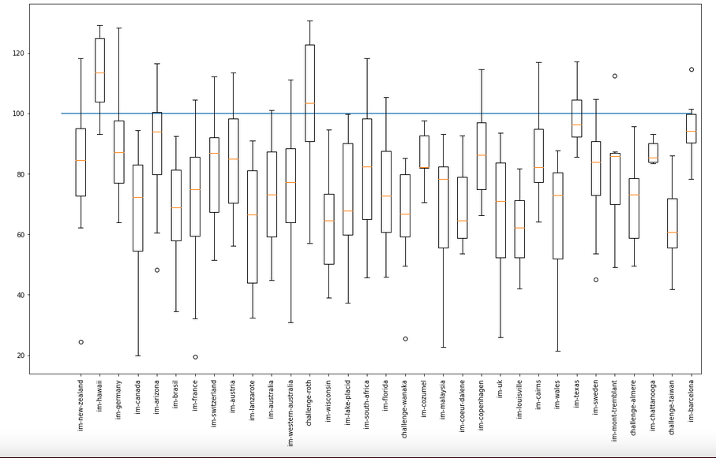
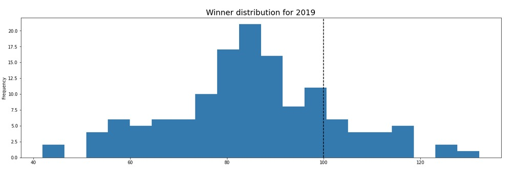
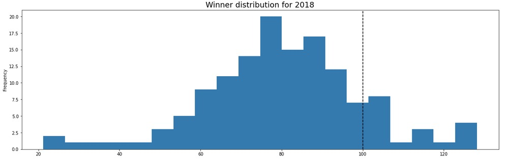
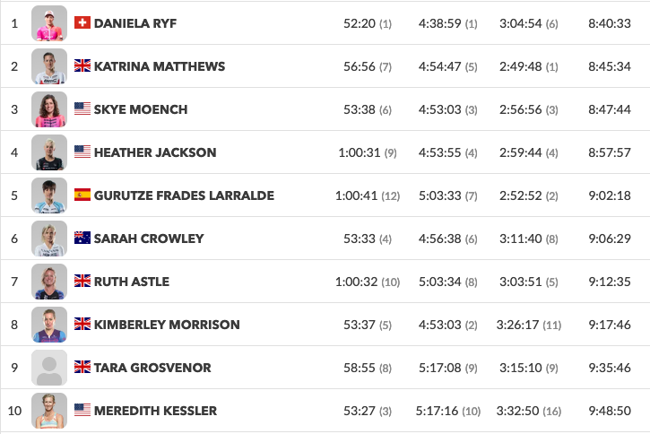

<div class="container">

<div class="important"> 

**<u>Disclaimer</u>**: I am not an athlete nor can I claim to be a
hardcore triathlon fan. I am not directly affected by the outcome of
different ranking strategies, financially or spiritually. My interest
in the problem is purely from an algorithmic game theory
standpoint. Ranking strategies often lead to pathological behaviours
([see](https://youtu.be/TM_QFmQU_VA?t=494) for an
example). Understanding and analysing the mathematical underpinnings
of such behaviour is a personal research interest. Note as these
systems represent rank actual people with feelings and were developed
by a different set of humans (also with feelings), I have tried to
remain as neutral as possible in my discourse. In the off chance
someone is offended, I apologise.  </div>
</div>


# Part I - Where do Triathlon rankings come from ?

A friend recently introduced me to [World Triathlon
Rankings](https://stats.protriathletes.org/rankings/women). It got me
thinking about how these rankings are calculated. The Professional
Triathlete Organisation (PTO) provides an explanation
[here](https://protriathletes.org/the-pto-world-rankings-explained/).
The immediate question that I had was, how do you compare athletes who
never race each other on the same course. Unlike Formula 1 or the
Premier League where each racer/team competes with each other across a
season, long course athletes rarely compete with each other. Shown
below is $N$ x $N$ normalised co-occurence matrix of how often the
best athletes actually race each other. Here $N$ depicts the top
$N=35$ women professional triathletes as of May 22, 2021. The men
follow a similar co-occurrence distribution.


There were 160 half iron-man or iron-man races from in 2019, 2020
and 2021. A cell score of 1 would mean those 2 athletes raced all 160
races together. The figure above indicates a high score of .035 which
would indicated two athletes shared a race about $6$ times out
of 160 races and this is the most frequently two athletes compete
against each other on the long course over 3 years. This makes
intuitive sense and is unlikely to change in the future. Endurance
events are physically draining. Long course athletes cannot compete at
an optimal level every month. Furthermore, travelling for triathlon is
an expensive ordeal. Athletes in Australia do not usually compete in
the major European races. Barring a handful of races like Hawaii,
Challenge Daytona and 70.3 Worlds, it is unlikely athletes will
assemble for the same race. More about this later.

**The primary blocker to figuring out how to rank professional
triathletes - is to come up with a solution to compare two separate
race performances on the same scale.** If this problem did not exist, this problem would not be hard nor controversial. Athletes live in different parts
of the world and cannot always travel to major races. This implies
that neither the strength of the field nor the number of professionals
attending a race is the same every race. Shown below is a the
attendance distribution of 70.3 and Ironman races across the last
three years for professional womens sport.


As discussed earlier, we observe that not a lot of professional
athletes show up to every race. Next we look at the strength of field
of races. The formula to compute the strength of a field for a race is
slightly contrived. For a given race $r$,

$$ Strength(r) = \sum_{a \in r} \frac{1}{rank(a)}$$


For a given race, we just sum the reciprocal of the world ranking of
the athlete. For an athlete not in the top 100, we give them all a
rank of 101. This implies, if an athlete is not in the top 100, they
have the same impact on the strength of the field regardless of their
rank. The general idea is borrowed from [Mean Reciprocal
Rank](https://en.wikipedia.org/wiki/Mean_reciprocal_rank) used to
evaluate Search Retrieval Systems.


**NOTE: I need to think this through a bit more. MRR doesn't really
apply here. Also I use the current world rankings and not the world
rankings at the time of race. This doesn't really change the shape of
the distribution and important races do end up having a higher
score. However, we need to think this through further.**

<div class="important">
**Update 2022-02-14**: The above formula is just a heuristic. It has no theoretical justification. MRR while looks similar, denotes something completely different. A better way to capture the strength of the field is to use a sum of estimated quality scores as described in [part III](../PrimoRank/).

Though not principled, this heuristic succeeds in sending the right message about an alteady well known representation of strengths of fields. **They are not evenly distributed.**
</div>


Using the above formula, IM Hawaii 2019, the world championship had a
strength of $2.67$ wheras IM Ireland had a score of $0.059$.

Such a variance in strength of field prevents us from using simple
scoring systems like they use in Formula 1; where the winner of a race
is awarded 25 pts, second 18 pts and so on. Most triathletes would
agree that winning the world championship is more impressive than
winning a regional race like IM Wisconsin. Some athletes would argue
hilly courses suit them while others argue windy ones suit them. So we
cannot weight performances of all races equally. If we did, we
incentivise athletes to seek out the weakest fields and races that
suit them. This prevents the sport from having the best compete with
the best, thereby reducing triathlons value as a spectator sport.

Given what we have discussed, this problem is non trivial to solve. In
the next section we look to understand how the current athlete scores
and ranks are computed. How did the PTO navigate the issues we just
discussed?

## The Current System

For any race $r$, there is an expected finish time
$\mathbb{E}[r]$. Let $\overline{\mathbb{E}[r]}$ be the estimate of
this expectation (the PTO website calls this number AIT). We defer the
discussion of how this estimate is computed. Assume it exists and is a
fair number for all races $r \in R$, where $R$ is the set of
races. The PTO claim that this number is adjusted for courses - hilly,
windy, cold etc. For now we assume this is true. We will defer the
veracity of that claim for a later post.

Let the finish time of athlete $a$ for race $r$ be $f(a,r)$. The score
or world ranking points for that race for athlete $a$ is defined as:

$$S(a, r) = 100 + (\overline{\mathbb{E}[r]} - f(a,r))/\delta$$ where
$\delta = 0.15\%*\overline{\mathbb{E}[r]}$.

In words (from the PTO website), If an athlete equals the AIT for any
eligible race, they receive 100 World Ranking Points. If an athlete is
faster than the AIT, they are awarded an additional World Ranking
Point or fraction of a point for each .15\% by which they beat the AIT
-- where AIT is $\overline{\mathbb{E}[r]}$ in our notation.

See worked out example:
```
-----------------------------------
2019 IM Hawaii Women AIT:  09:01:46
----------------------------------
Anne Haug finish time - 8:40:10
Lucy Charles finish time - 8:46:44

Using the formula described above, delta = 48.75899999999999

----------------------------------
Scores:
----------------------------------
Ann Haug : 100 + [1296/48.758] = 126.57
Lucy Charles: 100 + [902/48.758] = 118.49
```
We verify our estimate  with the reported number on the site.


The final score for an athlete is the sum of an athletes best 3 races
in a year, as quoted by the
[website](https://stats.protriathletes.org/points). The Collins cup
qualifying has a slightly more complicated protocol but it is still
based on points calculated of AIT and can be found
[here](./PTO_scoring/)

```The PTO World Rankings shall be determined by the aggregate number
of World Ranking Points an athlete has earned for their three best
races for 2021, with the final rankings on December 31, 2021,
determining the pay-out to PTO Professionals under the PTO Annual
Bonus System.
```

## Some immediate consequences of such a system

The PTO's approach is to use AIT or an estimate of expected finish
time to normalise across races. Under the current system, given a race
$r$, to maximise one's chances to improve their PTO rank, each athlete
should try and beat the AIT of a race. Racing other athletes is
secondary. Such a scheme leads to the following scenario. Consider the
following example:

```
Athelte A and B are competing for the same PTO world ranking

A and B's history of points so far  looks like the following:

A : 99, 100, 88
B : 101, 97, 86

Yearly points:
A: (99 + 100 + 88)/3 = 95.66
B: (101+97+86)/3 = 94.66

B needs to get 3 points more than A in a race to win.
```

Looking at the scores so far one would assume $A$ and $B$ are very evenly
matched i.e. in all races so far, they have had similar finish times.
The last race of the year should be a decider for who should take the
spot they are competing for. Now they are racing a course on a really
windy and rainy day. Lots of races have wind and rain variance across
the years. All athletes are way off the expected finish time.

Everyone is suffering, but $B$ manages to beat $A$ by a good 30
minutes. In professional Ironman, such a gap is considered to be a
demolition. Intuitively, for two evenly matched athletes, $B$ having
won the decider decisively, $B$ should get the higher spot. They raced
4 times, A won twice marginally, B won once marginally and once
decisively.

However based on the PTO scoring system, $B$ does not usurp
$A$. Despite $B$ winning the race, and $A$ having a terrible race --
the race conditions meant that all athetes were way off the AIT. Thus
the maximum points to be gained from this race is much lower than
their historical scores. The PTO takes only the top 3 races.

### But does such a thing actually happen?

At this point the reader might be wondering if such a situation really
happens? Can you win a race and still get really low race points? The
answer is YES! It happens all the time. Shown below is the
distribution of the race winners points for long serving races. For
races that have been organised annually for at least 5 years in a row,
we examine the distribution of winner points.



On the Y axis is the race points won by the women's winner of the
race. On the X axis are different popular races. Multiple races like
IM-UK, have had winners vary from the scores 20 to 80 over a span of 5
years or more. On the contrary, the winner at Hawaii has consistenly
outdone the expected finish time. It also appears that AIT points
prefer certain courses like Roth over courses like IM UK. Or in other words, you are always better off racing Roth over IM UK, regardless (almost) of where you finish. The reader
might infer that this is because Roth usually has a stronger
field. However, we show later in this document that, this is not the
case. Intuitively, the above formula for scoring does not take into
account the strength of field. (**NOTE: The AIT computation might
indirectly, but as we show later it is not really represented in the
data)**.

It should be noted that the score obtained by an athlete is based
purely on the AIT time. Winning a race with a very strong field gives
you no advantage in your world rankings. The only incentive to be
ranked higher is to beat the predicted time. Also so far we have
ignored, how accurate this predicted time actually is. From the figure
above, it would seem it is not very good at predicting the race winner
time. Ideally the race winner should on average be close to 100
pts. However, when we look at the distribution of winner finish times
in 2018 and 2019, it seems that AIT overestimates athlete performance
consistently. Shown below is the winner pts distribution for the
women's pro field across all races that had an AIT in 2018 and 2019





It seems that on average the winner of pro race in the women's field
receives 80 points, thereby missing the expected time for a race most
of the time. **Important: **Despite showing that the current system
has very high variance, our results so far do not indicate the current
system is dysfunctional. All we have shown that under certain
circumstances, the current system might disadvantage certain athletes by down weighting certain courses. We are
yet to show that points system has actually hurt athlete rankings in
practice or quantify how likely the system might screw someone over. We
do this next.

### I beat the best athletes and was worse off for it

In this section we show how the avg points awarded to the top 3
participants vary with the strength of the field. We use the formula
defined above. While it is not callibrated properly, it is still
monotonic with perceived strength of field and serves to illustrate
why the current system could be problematic. The blocks shown in red,
are races where racers achieved high scores while winning in a weaker
field compared to the green box. The green box race winners scored
equal if not lower points while beating much stiffer competition.

As qualitative reference for understanding these numbers we reference
to the two races below. We let the readers decide which race was more
stacked, and which one should regarded more.


The reader might notice that at the extreme right there are few
scatter points flying around.  Those represent the world championships
and challenge daytona.  Really big races rarely have low scores. This
is natural. Assume the probability of an elite top 20 athlete having a
misfire is $\epsilon$.  The probability all of them misfire is
$\epsilon^{20}$. Say $\epsilon$ is very high like $30\%$ i.e an elite
athlete bonks in 3 out of 10 races, the probability that we still see
a high score is $99.99\%$. This is desirable, we want to reward
athletes winning stacked races. The issue is on the other end. There
are plenty of races with much weaker fields that where winning is
rewarded on the same scale as winning the bigger races.

Let us look at the case of Holly Lawrence. In 2019, Holly was ranked
5th in the world and in that entire year she had won every race
barring two. In the two she had not won, she had lost to only Daniela
Ryf - the world number 1. In fact she had beaten the following
athletes ranked above her.

```
4 Sarah Crowley 1.0
3 Anne Haug 1.0
2 Lucy Charles-Barclay 1.0
```

So in a year where Holly had beaten all athletes ranked above her
excepting Daniela, she still got ranked 5th. Why? It is because Lucy,
Anne and Sarah ran some other race Holly did not race and beat the AIT
by a bigger margin. Athletes are not aware of the AIT before a race,
so they have no idea if they can beat it. 

Eventually in [part III](../PrimoRank/) of this series we show Holly would have gotten a better rank under our model assumptions.

Before we go into further disadvantages, we describe to the reader some education pointers we picked up while talking to athletes.

## A slight detour: Understanding the incentives of the sport

Any ranking system is inherently transitive. If you rank A, B and C in
ascending order. It says on average A would best B and B would best C,
thereby indicating A would best C by the transitive property.

Before we try and design/evaluate a system that pits athletes against
each other, it is important to understand how athletes think and what
they value in the sport. **Disclaimer**: I am not an athlete. This is
an attempt at summarising my understanding of how professionals
race. This information is gathered through face to face conversations,
viewing official races and race interviews. It appears that for an
elite athlete, there is one primary goal -- to qualify for and win the
world championship. For the Ironman distance, this race is Kona. The
70.3 has an annual world championship every year as well. Winning the
aforementioned long course races is considered the pinnacle of
sporting achievement. Throughout the rest of the season the focus of
the athletes is to get a spot in one of these races. Once a spot is
secured, the focus shifts to ensuring a peak performance in
Kona. Whether this assumption is true or not can be debated by people
who actually race for a living. It should be noted that the system
before 2017 was based on points accumulated during a season. Ironman
spcifically went away from that system to prevent athletes from
burning out before the big race. For now assume my assumptions hold,
and let us understand how the current system is misaligned with how
athletes race. After building this intuition through qualitative
analysis, we will look at the empirical comparison of top 5 athletes
at kona and end of the year world rankings.

We first begin with how Kona qualification works.There are plenty of
[blog
posts](https://www.triathlete.com/culture/news/the-good-and-the-bad-of-the-new-ironman-world-championship-pro-qualifying-system/)
out there describing how this works. Some athletes do not need to
qualify for Kona:

* Last years winner of Kona. 
* Last years Kona podium athletes.
* Last years 70.3 winner.

**However, these athletes must still complete a “validating” race,
where they complete the distance within the racing year.**

Let's pause and think about what the implications of that one
statement are. The above list of athletes are elite - they have won
the bloody thing last year. Rankings are re-done every year. So in
this new year, these athletes just have to finish some race, to make
sure they can go to Kona again. There is no incentive to win or post a
fast time. Why bother? There might be risk of injury. Going to a race
has a lot of faff to it. However in this race they will be awarded (or
not awarded) points. It might be still be considered for computing
rankings. One could argue that the PTO only uses the top 3 races in a
year. So these races won't be considered. Such a statement is only
true if an elite athlete races a lot more than 3 times a year. We will
look into how often professional athletes race in a later section.

Now for those who did not get an automatic slot, we copy this excerpt
from a post describing qualifying

```For Kona qualifying, there is one slot per gender at most races,
two at regional championships, plus extra “floating slots” allocated
to specific races, usually regional champions or bigger races Ironman
chooses. (You can see the full pro calendar with its allocations) This
is where it gets a little confusing. The two floating slots will
either be split evenly between men and women or will both go to one
gender, based on how many men and women are on the start line that
day. There are 100 slots total.```

There appears to be some controversy regarding how floating slots are
assigned but it is beyond the scope of this document. The big takeway
from the quoted text is the following -- to get to Kona you must win a
race and that gets you to the championship. Nowhere does it say, you
are better off if you go faster. Under the current ranking system, one
is always encouraged to go faster. One could argue, that going fast
and winning are extremely correlated. Does that not equate to the same
thing? The short answer is "yes but not really". Athletes do not
always need to push themselves to the maximum in every race. Let's
consider the following example:

Shown below are the results for Ironman Tulsa on May 23rd, 2021.



Before the race started, the following athletes were already Kona
qualified. There were two spots available for qualification in this
race.

* Daniela Ryf
* Kat Matthews
* Sky Moensch
* Heather Jackson
* Sarah Crowley
* Ruth Astle
* Meredith Kessler

Just Gurutze Frades Larralde, Kimberley Morrison and Tara Grosvenor
were not qualified going in. Kimberley Morrison was awarded a Kona
Spot for this race. She came off the bike in second place but her real
incentive was to not be crossed by more than 1 athlete without a Kona
Qualification spot. That was the safer strategy given the goal of the
sport and knowing a lot can go wrong in the marathon leg of an
ironman. Similarly Daniela Ryf came out nearly 20 minutes ahead on the
bike. She does not need to run the marathon at her maximum effort to
secure podium. Athletes race each other. They swim/bike/run as fast as
they need to secure podium. Should their efforts be judged against
some arbitrary predefined time for completion? Post race, Kat Matthews
(I cannot find a link to the interview), declared her goal was Kona
from here on. She would not be racing any long course events from here
on. She might do some 70.3 races to stay in shape.

At this point we have hopefully convinced you that most athletes do
not need to race each race to their fullest ability and that most
athletes want to peak for Kona. What this implies is, that even the
strategy of best 3 races in a year is likely sub optimal. This makes
the problem of ranking triathletes even harder. Not only do they not
compete against each other often; even when they do - they might have
different incentives.

In the next section, we look at how often athletes race once
qualification is secured.

### Do world ranking represent Kona behaviour

Kona (or 70.3 Worlds) is the one race the best athletes race each other on the same
course with the same incentives - TO WIN.

Shown below are the end of they year world rankings for the top 5 men
athletes at Kona. On inspection it might not look too bad. It would
seem like the world rankings system is pretty good at picking the top
3 athletes. However, this is an artefact of having two very dominant
champions over a long time i.e. Jan Frodeno and Sebastien Kienle were very dominant. When
you have a champion like Jan who is so dominant, the ranking system
does not matter. Whatever the sytem, they usually always win. As an
exercise we leave the reader to look up how positions 5-10 align with
world rankings to convince themselves.

| Year | 1st | 2nd | 3rd | 4th | 5th |
|------|-----|-----|-----|-----|-----|
| 2019 | 1   | 10  | 4   | 6   | 11  |
| 2018 | 4   | 8   | 9   | 18  | 14  |
| 2017 | 4   | 1   | 14  | 3   | 7   |
| 2016 | 1   | 2   | 29  | 4   | 12  |
| 2015 | 1   | 15  | 3   | 4   | 34  |
| 2014 | 3   | 13  | 1   | 12  | 37  |


The women's table:

| Year | 1st | 2nd | 3rd | 4th | 5th |
|------|-----|-----|-----|-----|-----|
| 2019 | 3   | 2   | 4   | 8   | 9   |
| 2018 | 1   | 2   | 3   | 14  | 19  |
| 2017 | 1   | 7   | 6   | 3   | 19  |
| 2016 | 1   | 8   | 5   | 20  | 21  |
| 2015 | 1   | 2   | 20  | 16  | 10  |
| 2014 | 1   | 3   | 2   | 6   | 4   |

Once again it might not look egregious. Both tables have some outliers
or surprises. The women's field has had dominant champions in Daniela
Ryf, Lucy Charles, Anne Haug and Mirinda Carfrae. In sport whenever
you have dominant champions, the ranking system for those athletes
becomes redundant. They come out on top on with all systems. The more
interesting distribution are the athletes ranked 5-15 in both
genders. 

<div class="important">
**Update: 2021-02-14**: For those that try the exercise, we show in [Part III](../PrimoRank/) that these rankings do not fairly account for Kona. Refer to the Carrie Lester case study.
</div>

It remains a philosophical question how much the championship
should dictate world rankings. Under the current system, it has the
same weight as all other races. That seems unfair given not all races
have the same field nor the same incentives. We could also base the
entire ranking off of Kona performance, which seems unfair as
well. Someone who has been consistent all year could have an off
day. Should their entire career ranking depend on one race?


## What works for the current system

Before discussing alternate rankings we would like to point out some
biases of the current system. Some are positive and some are negative like any ranking system.

### It's quite simple

The controversy is regarding how they came up with AIT. If we assume the AIT is a fair time, then the
scoring is deterministic and interpretable. This is a very important
feature of ranking systems. Fans and athletes crave simplicity. We should try and remember this at all points of this series.

### It is difficult to game

One of the strongest attributes of the current system is that it is
impossible for athletes to game. Given that nobody knows before a race
how many points can be gained from a race, it is impossible for
athletes to cherry pick races. It just so happens that some races give
athletes an unfair advantage. However there is no easy way for an
athlete to know this before hand and game the system.


### Drop Outliers

The scoring system only takes the top 3 races for an athlete. While
there has been no theoretical justification as to why the number 3 was
picked; the community seems to have accepted the number as fair. By
only taking the top 3 races, it allows athletes to take risks in races
and not fear blowing up. This also implies that we do not reward
consistency. As an athlete you are always incentivised to put all your
chips in the pot and go for it. If you blow up, we will just drop this
race from the ranking. As long as you do not blow up all the time, a
bad performance does not hurt your score. This is unique to triathlon
to the best of our knowledge. In this universe a bad performance does
not hurt you. It is simply like it did not even exist. You are
measured only by your good performances. Not many ranking systems in
the wild employ this strategy. Imagine having a day job where we
ignore your screw ups? As a direct consequence of such a system,
Daniela's Kona 2019 performance or Jan's 2017 Kona performance do not
affect their scores at all. It remains a philosophical question for
the people in the sport to decide whether it should or not.

### Triathlon is not really a head to head sport but it kinda is

In order to score a performance, the current system pits an athlete
against the clock and not against each other. We have already argued
that pitting athletes against the clock is not meaningful, but by not
pitting them against each other; the current system circumnavigates
the problem of disjoint universes (or sparsity) i.e. athletes do not
race each other often -- so there is no way to compare them
directly. Someone with a little background in ranking might argue that
this problem exists in Chess, American College Football, Scrabble,
Video Games, Pro Tennis and many other sports. They get around it
using modifications of the extremely well studied
[ELO](http://abiswas3.github.io/blog/eloExplained/). All of the above
sports navigate the problem of sparsity by making the assumption of
probabilistic transitivity, which states -- if A beats B with high
probability and B beats C with high probability, then A also beats C
with high probability. This is not untrue of triathlon, however such a
model also makes a assumption which does not hold true for
triathlon. The assumption is as follows: Assume two players A and B
play a Tennis match against each other. A is the highest ranked player
in the world, B is a new player with provisional rankings. If B were
to beat A, A's loss on that day can be attributed to B's skill on that
day being higher than B's expected skill. If both A and B had
performed to their expected skill level, A should have won. Given this
assumption, it is fair to reward B with a lot more points for beating
someone much higher than their skill level, as they performed much
better than our expected belief of their skill.

This does not hold in Triathlon. Consider the 2019, women's race in
Kona. Daniel Ryf went into the race with the following record.


She had won every race she had participated in and went on to have an
off day at the race. On this day she came in at 13th. In a head to
head model, all 12 athletes that beat her did not necessarily race
much better than their expected skill. They might have done as was
expected of them. It just so happens that Daniela Ryf had a tough day
and performed much lower than her expected skill level. So it would
seem unfair to reward all of these other athletes as if they had
performed much better than expected because they beat the best athlete
in the world. We cannot take the results of a race, convert them to
pairwise head to head battles and use ELO. [Part III](../PrimoRank/) does just exactly this. Daniela is not rated as the worlds best triathlete for that year. One could argue that this is not all that unfair, and showing up on the biggest day is most important. This is a philosophical debate we are not qualified to answer. In part III, we describe in detail how one can use head to head battles to rank an athlete.


What the PTO currently does, **is ignore this problem completely**. They
decided to base the scoring system based on an expected finish time
known as AIT. Every athlete races the clock. The clock is there for
every race. This ignores who you are racing or how someone else does
with respect to you. This is not a bad idea in principle but winning a
race with strong competitors is still harder than winning a race with
an easy field, regardless of the time. Additionally we have shown that the the PTO clock is not stable across courses. Given what we understand to be the incentives of the sport, one cannot ignore this problem and also rank athletes. The results would not be meaningful.


### It's really hard to rank this sport

Finally, despite critiquing the scoring for most of the document,
this is a reasonable baseline. The problem of ranking athletes that
do not race each other frequently is a hard maths problem. Many clever people have tried. If you're interested, you may read [Lucas Maystre](https://lucas.maystre.ch/)'s PhD thesis.  People really have been studying this for over a 100 years.


## Where to from here?

We first recommend a model based purely on intuition. There is no mathematical reasoning behind this. It's trivial to understand and was recommended by someone who actually did the sport and was good at it. You can find it [here](../TommyRank/).

Finally, we take a more principled approach to describing what a ranking could look like. We state are assumptions clearly and justify them using case studies. That analysis can be found [here](../PrimoRank)


</div>
