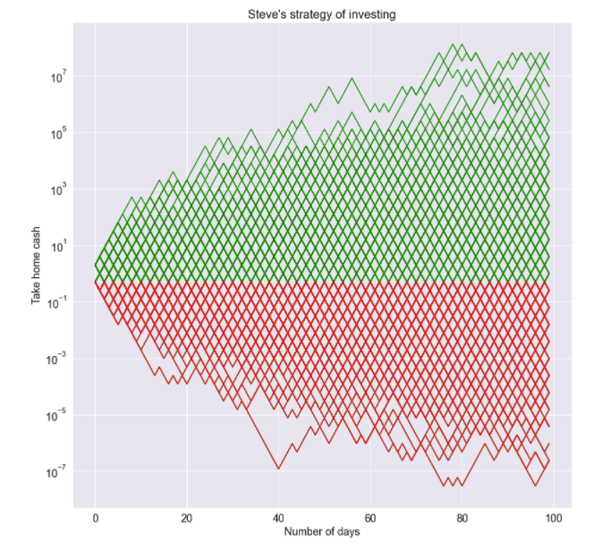
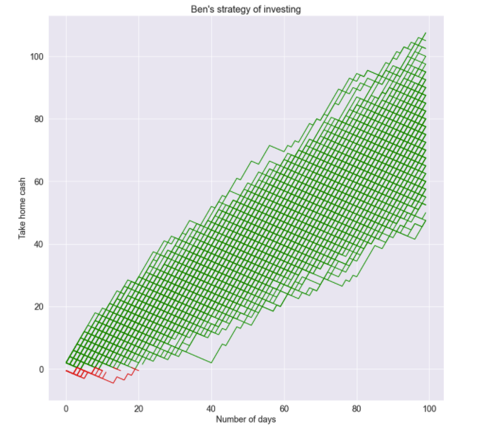
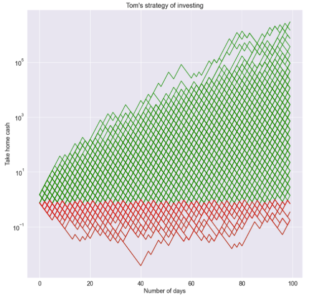

<div class="container">

```Primo lecture series in mathematics: Shannon's Demon```

# My friend Tom

My friend Tom is a real man's man. He fears no man, surfs with sharks, descends on a bike without using his hands and goes even as far as opening his worldle without vowels. It was only a matter of time, before such a man found himself on the roulette tables of the Cambridge Stock Exchange(CSE). With a gun in his holster and cowboy boots from Essex, he will certainly not be investing in the diversified public the market or be tracking index funds. No, not our Tom. He's here to bet on individual volatile stocks - like those pictures of crypto cats. He sees things that no one else sees. The question is, what does he really see?
 
## The setup

The CSE is a very simple market place -- it has a single stock whose price either doubles or halves everyday with equal probability. At the tables of this exchange we have three characters -- *Sexy Steve*, *Bicyclist Ben* and our friend Tom. Tied at the hip since birth, these three punters do everything together. All three of them observe that on average they stand to gain $1.25$ dollars per 1 dollar invested.

Let $Y$ be the random variable depicting how much money I have after one day and $X$ denote how much money I start with. We have 

\begin{align}
\mathbb{E}[Y] &= \frac{1}{2}\text{ Money double } + \frac{1}{2}\text{ half } \\
&= X + \frac{1}{4}X \\
&= 1.25X
\end{align}

Setting $X=1$ we see we get $1.25$ dollars per $1$ dollar invested on average.


## Sexy Steve and Bicylist Ben have a go

*Sexy Steve*, known in the rougher parts of Cambridgeshire as a ladies man decides to invest first. *Deceitful Doug* tells him about the benefits of compound interest, and observing that he makes a profit on average he decides to let his $1$ dollar sit for a long time.

*Bicyclist Ben* has spent years in the professional cycling peloton splitting his valuable time between recreational drug users and miserable sports dopers. He knows how to spot bad advice from miles out. He knows to get compound interest to work, the geometric expectation of the random variable must be positive. Above we only have the arithmetic expectation to be positive. More on what those fancy words mean later, but this is what Ben does. Regardless of the outcome of the day, he cashes out everyday, and puts a fresh $1$ dollar into the pot. "Madness!" shouts *Sexy Steve*, "haven't you heard of compound interest??"

Below we show a uniform sub sample of all the possible outcomes for Steve and Ben. A green line indicates that a profit has been made. The dreaded red indicates those money-grabbing sleazebags at CSE have won.


Despite having a net positive daily expectation; *Sexy steve* either makes it big or goes bust with equal probability. He did get all the benefits of compound interest with all drawbacks of losing money equally equally. With this strategy, Stephen is playing roulette.

</img>

Benjamin on the other hand, almost never loses any money on the long run. The shrewd bike rider avoided all the pot holes and crashes only to get linear growth in pay. While Benjamin grew richer almost certainly, he only gained enough riches to afford himself 1 day at the go karts after days of saving -- but taking inflation into account, poor old Ben did not even get his day at the races.

</img>


## Re-balance and diversify

Tom opts for the simple strategy which he borrowed from Claude Shannon when they met in the gambling tables of Las Vegas in the early 50s. He takes his 1 dollar and invests half of it. The rest he saves. At the end of the day, he adds his earnings and then invests half; and saves the other half. He repeats this process every-day. Can Tom be exponentially rich without any risks?

</img>

Oh yes he can :-). His chances of going into the red are significantly lower, while his potential to make exponential money remains the same.

## What just happened ?

Well if you talk to a financial expert they might throw out words like Kelly's principle or volatility drag or parrando paradox. To be fair, I did not the original paper by Kelly nor do I know what those words actually mean. So I'll explain it using some middle school mathematics.


</div>
