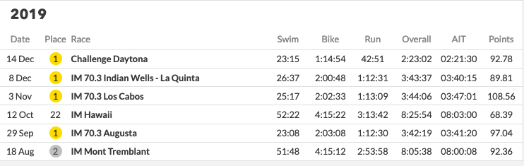

<div class="container">
<div class="important"> 

**<u>One very important disclaimer</u>**: I am not an athlete nor can I claim to be a hardcore fan. I am not affected by the outcome of different ranking strategies, financially or spiritually. If I use an athlete as an example, I do not actually know the athlete -- I am going just by the numbers. I have tried to remain as neutral as possible, but in the off chance someone is offended, I apologise. The same goes for the original creators of PTO ranking. I do not think I could write this post without them downloading all race results and putting it one place for me to download. It's harder to build something from scratch than to improve one tiny piece of it. The good news is, I have no followers on any social media platform, thus this post will never go viral. Your reputation is safe. I also make a lot mistakes in spelling, grammar and code and sometimes prove things incorrectly-- so do not trust everything I say. I believe that the people affected in triathlon i.e. those with skin in the game should really decide what behaviour should be rewarded in triathlon. 

</div>
This document can be viewed as an example of an educated guess at a solution (but not a principled one)

# Part II -Introduction  

In [a previous post](http://abiswas3.github.io/blog/ProblemStatement/)
we described in detail why we believed the current ranking system to
be sub-optimal. In this document, we motivate a new system for ranking
triathletes, under new assumptions. We call our algorithm **Tommy
Rank** - dedicated to [Tom
Vickery](https://www.instagram.com/tomvickery/?hl=en) who introduced
this problem to me. We propose variants of our algorithm and allow the
reader to compare the outcome against the current system. Although
Tommy Rank is not theoretically justified in itself, we can make a connection with the well understood [Plackett-Luce
model](https://cran.rstudio.com/web/packages/PlackettLuce/vignettes/Overview.html)
for ranking, that has been studied in detail for over fifty years. For now, we
decided to go with Tommy rank owing to its simplicity and
transparency. You should not read too much into the rankings proposed by Tommy Ranking. Retrospective rankings are unfair to begin with -- we tell you why in [part III](../PrimoRank/)


## A brief summary of what did not work

Now we address the issues of the current system. We have already
described in detail how the current scoring system does not align with
the motivation of the sport. Here we list the major points only. For a
detailed study refer to [this
work](http://abiswas3.github.io/blog/ProblemStatement/).


### AIT is not calibrated with what perceived difficulty

In our opinion this is the biggest disadvantage of the current
system. Based on the discussions we have had so far, athletes value
certain races higher than others because of the strength of the
field. While the performance of an athlete is not affected by the
strength of field, their final position in the race is. In section["I
beat the best athletes and was worse off for
it"](http://abiswas3.github.io/blog/ProblemStatement/) we show how
often this happens. If you did not read the previous post, here is a
couple of choice examples, Fenella Langridge was awarded 82 points for
finishing 7th in Challenge Day, while Nikki Bartlett received 83 points
for placing third in Eton Dorney Triathlon. Similarly, Lucy Hall won 87
points at Eton for a second place, whereas Amelia Watkinson earned 88
for a 5th at Challenge Daytona. Popular consensus from interviewing
fans and athletes was that a top 6 at Challenge Daytona was a bigger
accomplishment and should be rewarded accordingly. The system is
flawed by design - As an athlete one can only beat other athletes they
are faced with. Without prior knowledge of the maximum available
points, it is impossible for an athlete to seek out races with
meaningful points. The system must encourage the best to compete with
the best. Only then can the rankings be taken seriously. The AIT score
as exists today is more of an opinion than a mathematical model.

In [part III](../PrimoRank/) we carry out multiple case studies that demonstrate that AIT is likely to be uncorrelated with perceived difficulty. (NOTE: We did not run an experiment to verify that claim. It is a conjecture.)

### It leaves athletes and fans in the dark

Triathlon is a spectator sport. The current ranking system has been
described as too complex
[by](https://www.triathlete.com/culture/news/how-pro-triathletes-are-now-being-ranked-and-not-everyones-happy-about-it/?utm_source=twitter&utm_medium=triathletemag&utm_campaign=68839c2e-e9b8-4432-a616-63ec9eaf6e06). Shown
below are the results of the Dorney Lake Triathlon.


The screenshot was taken on June 15th, 2021. The race concluded 2 days
ago. The athletes still do not know how many points they
collected. Given these scores are used to rank athletes and qualify
for the collins cup, it is impossible for an athlete to know before
hand who they have to beat or what time they must run to make it into
the Collins Cup. [Linked here](https://youtu.be/CCCSwYRpBkE?t=432) is
a video by Lucy Charles where she claims explaining the same issues.
Despite winning comfortably, she did not know how many points she had
acquired. We argue this complexity prevents the average spectator from
investing in the tournament. In the UEFA champions league knockout
stages, everyone is aware of the results that would allow their team
to go through. This knowledge creates pre-game excitement and also
allows teams to set up accordingly.

### It has no theoretical justification or transparency

We're aware most readers would not consider this to be a weakness. One
of the advantages of ELO based rankings is that has a rich history of
mathematical justification. The approach is designed with assumptions
clearly stated. Note: This does not imply the system is perfect. 

It implies there is a reasonable understanding of the current flaws in
the system. The understanding of how and why the scores are updated in
ELO are transparent. This allows us to fix perceived biases and moments of discrimination. [Glickman](http://www.glicko.net/research.html)
wrote his phD thesis understanding these rankings and debating its
implications and flaws. The same cannot be said for AIT. Why did we
pick top 3 races in a year? Why does 0.15% difference result in 1
point advantage? How is AIT calculated? What are the justifications
for that formula. Although, we acknowledge these questions might appeal more
to academics than average fans and athletes, we have shown that over simplification can lead to discrimination of courses.

At the very least, in absence of rigour, a scoring system should be simple and fair. The current system seems complex and theoretically unjustified, which is the worst of both worlds.

### It treats 70.3 and IM as the same

Popular consensus is that the skill does not always transfer as
well. I am not an athlete and am not qualified to assert this claim
but it has been cited
[here](https://www.triathlete.com/culture/news/how-pro-triathletes-are-now-being-ranked-and-not-everyones-happy-about-it/?utm_source=twitter&utm_medium=triathletemag&utm_campaign=68839c2e-e9b8-4432-a616-63ec9eaf6e06)

# Tommy Rank - A Simpler Ranking System

No ranking system is perfect. Someone always gains a little and
someone always loses out. There is no free lunch. [Really! See
this](https://en.wikipedia.org/wiki/No_free_lunch_theorem) What makes
a good ranking system? We argue that it must be

* Simple and easy to understand. An athlete or a fan should know
  before and after a race the exact amount of reward they receive. The
  process should be transparent.
* Should not be gamed or unfair. It should align with a human
  perception of fairness. We would like to say For an athlete A ranked
  to be higher than B, we must be able to say that if A raced B often,
  A would beat B with high probability. This probability must be
  justified with empirical results.
* It should align with the incentives of the sport.

We acknowledge that these properties are somewhat subjective and not
always quantifiable mathematically. But such is the nature of the
world we live in. Put colloquially, ***we would like athletes to feel
that they have been screwed over people as infrequently as
possible.*** We want to do this by clearly stating our assumptions and
justifying our decisions mathematically. For this system we ignore statistical model and run free with intuition. We frown upon this but since we already have another approach that's more principled, we allow for a heuristic based approach guided by Tom Vickery's experience.

## Notation and Preliminaries [Skip if math notation is scary]

Let set $X = \{x_1, x_2, \dots, x_N \}$ represent athlete roster. Let
$R = \{r_1, r_2, \dots, r_k \}$ represent the k races in a race
calendar. Let $w_i \in \mathbb{R^+}$ for $i=1, 2, ..., k$ be the
perceived importance of a race. One can also think of $w_i$ as the
strength of field of a race. The world championship races and PTO
organised championships are expected to have higher value $w_i$ than
local races. The points awarded to an athlete are simply based on
their finish position. For a given race $r_j$, the points accumulated
for finishing in the i'th position is $\gamma_i*w_j$, where $\gamma_i
\in \mathbb{N}$ is an integer. It represents the value obtained from
finishing a certain position. Our model is already used in Formula 1
(rather we borrow it from F1), where the winner gets 25 pts, second
gets 18, third gets 15 and so on. Using our notation formula 1 race
scoring can be described as $\gamma_1=25, \gamma_2 = 18$ and so
on. With all $w_j=1$ for $j=1, 2, ..., k$ as all races are equal. We
denote the points received by an athlete $x_i$ in race $r_j$ by
finishing in position $p_j$ as

$$ Q_i(p_j) = \gamma_p*w_j$$ 

We set the score to 0 if the athlete did not participate in a race or
did not finish. Thus the premise is as simple as it can be. The points
you get are based on where you finish in race and everyone knows what
they are before hand. Triathlon's great issue is that not all races
are equal. This is where the strength of field comes in. Based on how
the strength of field is calculated, the total points accumulated for
a race changes. We will look to address the issues stated in part 1 in
the computation of the strength of field

The final set of scores for an athlete in a calendar year is given by


$$ X_i = \{ Q_i(p_1), Q_i(p_2) \dots, Q_i(p_k) \}$$

The final ranking is based on the sum of highest $m$ scores. The PTO
sets $m=3$. $m$ can be though represents the consistency factor. If
$m$ is high, then to be ranked high at the end of the year, the
athlete needs to place high consistently at races. If $m=1$, it says
having one incredible race is good enough. The strength of field
parameter dictates the maximum amount of points one can obtain from a
race.

So all that is left is to decide what $\gamma$ should be and how to
calculate $w_i$ for race $i$. The choice of strength of field and
gamma produces a unique alogorithm. 

## The above math in simple words

The points model is as follows:

* The points received from a race are like Formula 1 i.e. based on
  your position. First gets $\gamma_1$ pts, second gets $\gamma_2$ pts
  and so on.
  
* Not all races are equal. Some races are Cat A races like Kona, IM
  70.3, Challenge Daytona etc. Some races are Cat B races like IM
  Tulsa, IM St.George, Challenge Roth. For any race, there is a
  formula to calculate the strength of the race. Based on this score
  we categorise the race into different categories. The final score
  obtained for a race, is the position score times the strength of
  field discount. One can imagine Kona being the pinnacle has a
  strength of 1. A second tier race like IM Tulsa has a strength of
  0.9. A local race like Wisconsin could have a strength of 0.7.
  
* Assume coming first gets you 25pts. If you come first in Kona you
  get the full 25pts. Coming first in Tulsa gets you $0.9*25=22.5$ pts
  and Wisconsin gets $0.7*25=17.5$ pts.
  
* Based on how the strength of field and discount factor is
  calculated, we get different methds. In the next section we describe
  the different methods.
  
* The final score for an athlete is simply, the sum of the best 3
  races in a year calculated using the above formula. In the case of
  ties, we look at head to head record to break ties. If that is tied
  as well, then we deem the the athletes to be the same rank.

## A mini rant (not to be taken personally)

Take a look at the following performances and tell me who had the
better year? Especially when you only consider the top 3 performances.




Both have won multiple races. Both have come second
occasionally. They have never raced head to head and both have
occasionally bonked. One of them was ranked 2nd for the end of the
year performance; the other 15th. We even describe a theorem that says athletes need to race more to be ranked correctly in [part III](../PrimoRank/)

If the sport rankings want to be taken seriously, they need to have real professional races. Lionel
Messi does not play in your cities local Sunday league
tournament. Lucy Charles Barclay should not race in Eton Dorney as a
pro either. I know it is part of the culture of triathlon to let
amateurs and pro's mix but it makes it near impossible to actually
rank and score them. Athletes can race their local races as much as they like to preserve the culture of triathlon. But they must also race each other a lot. This can either be achieved my having separate pro races or we can have the athletes race more if they are able to.

Rant over!

# Simulations

Instead of describing the algorithms immediately, we allow the reader
to interact with them directly and judge if they are fair. We have
written up multiple variants of our model, to allow the reader to
decide what they find simple and fair.

* [COMPARE RANKINGS MEN](http://abiswas3.github.io/blog/mens_ranking/)
* [COMPARE RANKINGS WOMEN](http://abiswas3.github.io/blog/womens_ranking/)

Do not read too far into this. Retrospective rankings do not work. Such course grain bucketing of races makes it hard to really compare athletes. 

## Tom's Heuristic (Approximate Tommy Rank)

This method is **NOT** mathmetically justified. It is based on a set
of heuristics that Tom uses based on his experience. Given that he has
been in the sport for over a decade, a ranking system based on his
perceived fairness is not a bad place to start. It is simple and
appeals to intuition. It follows the general model described above.

Tom does not like Maths. He has no need for theoretical justification
of a ranking system. Tom believes the higher the prize money of a
race, the stiffer the competition. Therefor the points awarded for a
race should be based on prize money. This is not an unreasonable
assumption - If the perceived strength of field does correlate with
prize money, it's a simple and yet "fair" scoring system.

Also being a motorsport fan, he wants to use the well understood
Formula 1 scoring system because of its simplicity. NOTE: Formula 1
also did not justify their scoring theoretically, but when something
is simple and perceived fair -- you do not need to.

```
    1st – 25pts
    2nd – 18pts
    3rd – 15pts
    4th – 12pts
    5th – 10pts
    6th – 8pts
    7th – 6pts
    8th – 4pts
    9th – 2pts
    10th – 1pt
```

So going back to our math notation from before $\gamma_1 = 25,
\gamma_2 = 18$ and so on. For the strengh of field, he claims there
are 3 types of races. Category A which is for Kona, 70.3 worlds and
very high prize money - 200K and above. Category B which was consists
of most big regional races with prize money pools of 60K-200K and
Category C for 60K and under which consists of local races.

**Disclaimer: We write Approximate Tommy Rank because we do not have
the available prize money list for all historical races. Instead,
score the races using the formula described below.  Then we divide
races into Category A, B and C based on manually picked
thresholds. **.


The strength of a race $r$ is simply the sum of the start of the year
PTO scores for athletes participating.  Shown below are the scores for
women at the end of 2018.  These are the scores used for all of 2019.
For example, if Daniela Ryf were to participate in a race, she would
contribute 380.38 pts to a race. If Lucy and Daniela were to race,
that race would get 380.38 + 343.64 pts accordingly.


```
The 20 most difficult races in 2019 based on our heuristic formula are:

------------------------------------
| CAT A | discount factor = 1
------------------------------------
im-hawaii                    10361.0 [1] 650,000 USD
im-703-world-championship     6822.0 [2] 250,000 USD

------------------------------------
| CAT B | discount factor = 0.9
------------------------------------
im-703-st-george              4139.0 [3] $100,000
im-703-california             2835.0 
challenge-samorin             2397.0 [4] € 150.000
im-703-elsinore               2288.0
challenge-salou               2238.0
im-703-texas                  2201.0 [5] 150.000 USD
challenge-roth                2180.0
im-germany                    2127.0 [6] 150.000 USD
im-703-chattanooga            2071.0
itu-long-distance             1913.0
im-cairns                     1892.0
im-texas                      1861.0
im-lanzarote                  1847.0
im-western-australia          1844.0
im-cozumel                    1796.0
im-703-victoria               1788.0
im-703-vietnam                1763.0
im-703-santa-cruz             1756.0
im-703-mont-tremblant         1625.0
im-south-africa               1607.0
im-703-coeur-dalene           1604.0
im-mont-tremblant             1556.0
challenge-riccione            1529.0
im-new-zealand                1496.0
im-703-boulder                1488.0 [7] 60,000 USD
im-703-santa-rosa             1484.0
challenge-daytona             1483.0 
im-703-taiwan                 1454.0

The 10 weakest races were as follows:

im-malaysia               263.0
challenge-madrid          244.0
im-703-ecuador            243.0
im-703-buenos-aires       238.0
im-703-rio-de-janeiero    238.0
challenge-gunsan          213.0
challenge-vietnam-half    178.0
im-703-eagleman           156.0
im-703-japan              141.0
im-703-weymouth           136.0


SOURCES FOR PRIZE money listings 

[1] https://www.redbull.com/gb-en/kona-ironman-stats
[2] https://www.muscleandfitness.com/features/challenges/ironman-ups-prize-money-703-world-championship/
[3] https://protriathletes.org/race-preview-ironman-70-3-st-george/
[4] https://thechampionship.de/races/the-championship/
[5] https://www.trirating.com/ironman-germany-2019-analyzing-results/
[6] https://protriathletes.org/weekend-preview-ironman-70-3-texas-challenge-shepparton/

```

Shown below is the strength distribution using our formula and prize
money for choice races in 2019. We show this to justify that our
approximate ranking score is a reasonable. However, in practice for
Tommy Rank, the prize money should be used to decide the strength of
field. The 2020 prize money distribution for some races can be found
[here](https://www.google.com/url?sa=t&rct=j&q=&esrc=s&source=web&cd=&ved=2ahUKEwjUwKHI_KnxAhWHmBQKHS_vBhEQFjAEegQIChAD&url=https%3A%2F%2Fwww.teamusa.org%2F-%2Fmedia%2FUSA_Triathlon%2FPDF%2FElite-International%2F2020-Prize-Purse-Calendar.pdf%3Fla%3Den%26hash%3D4F23634A14B2B3FED9EC3BE15AED4D0DBBA5FFDA&usg=AOvVaw3k7ILq_Ei7-01JP5cxJKmP). We
cannot speak to the veracity of this link. It was obtained via Google
Search.


Shown above is the distribution of strength of field in 2019 based on
our heuristic. Based on inspection, we pick thresholds 5000 and 1500
to divide races into Cat A, B and C. The reader might point out that
we are using the PTO scores which we claimed to be sub optimal. While
that claim is true, we are quantising the races into coarse buckets --
most ranking algorithms will produce similar quantisations. We do not
expect the PTO races to rank an elite athlete nearly 40 places lower
than expected. Later, when we introduce the much studied Luce-Plackett
ranking, we will observe that the quantisations are
comparable. Finally, this is an approximation of prize purse. So it
does not really effect the true algorithm. When the prize purse is
available use that instead.

Using the notation described above $w_i = 0.7$ if strength of field
for $r_i \leq 1000$ i.e. Cat C races. Cat A needs the strength to be
greater than 5000 and everything else is Cat B which gets a $w_i=0.9$.

In summary the score obtained by an athlete for race $r$ is simply,
the discount factor times the position reward. Thus if one were to win
a Cat A race, they get 25pts. A cat B race gets you $0.9*25=22.5$ pts
and finally winning a Cat C race gets you $0.7*25=17.5$ pts. For
yearly rankings, similar to the PTO we sum the top 3 performances in a
year.

### Drawbacks

The biggest drawback of this method is that it is not principled in
its selection of quantisation thresholds and it uses PTO scores(though we could also use quality scores derived in [part III](../PrimoRank/)). There is no theoretical justification to using the prize purse either. We do
not justify our use of Formula 1 scoring either. So when someone does poorly, we cannot really trace it back to our assumptions and we did poorly. **We do not recommend building such systems.** Such systems look nice and simple on the outside but always land you in trouble later.

### Strengths
However, the method has a few strong properties:

* It is simple and transparent.
* It is difficult to game.
* It encourages the best athletes to compete with each other. Knowing
  you cannot get many points from smaller regional races, it promotes
  the best competing against the best.
* It allows independent races to allocate prize money and attract the
  best racers. It prevents the sport from being a monopoly.
* The method still follows the general mathematical model we
  described. It's just happens that the parameters of the model were
  picked based on intuition. Specifically, the formula for strength of
  field is not mathematically derived but based on prize
  purse. Replacing the approximate Tommy Rank with available prize
  money (Tommy Rank) is a reasonable heuristic.
* This ranking system has parameters that can be tuned for change
  different models of fairness. For example, the discount 0.9 and 0.7
  were plucked out of thin air. It is possible to align those numbers
  to the populations perceived difficulty of a race. Similarly, the
  ratio of points awarded to second vs third is up for debate. They
  should represent the athlete populations inner value of coming
  second over third.
  
## One more post

If the reader is not satisfied by such a laissez faire approach to ranking athletes, we are on your side. In [part III](../PrimoRank/) we put a little more thought.

</div>
