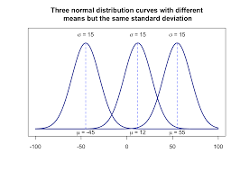

<div class="container">
# Introduction

The wikipedia page describes ELO as 

```The Elo[a] rating system is a method for calculating the relative
skill levels of players in zero-sum games such as chess. It is named
after its creator Arpad Elo, a Hungarian-American physics
professor.```

If you google how ELO works, you are usually presented with the
following two equations

$$ P(A \text{ beats } B) = \frac{10^{R_A/400}}{10^{R_A/400} + 10^{R_B/400}}$$

where $R_A$ and $R_B$ are the ELO ratings of player A and player B and
$P(A \text{ beats } B)$ is the probability that A beats B. Once player
A actually plays player B, we get one of the following realisations:

* A wins : $X=1$
* A loses : $X=0$
* Draw : $X=0.5$

Once this game is finished A's ratings are updated using the formula

$$ R_{new} = R_{old} + \Big(X - P(A \text{ beats } B)\Big)*K$$ where
K is usually 32.

## Worked out example

Taken from [talk](https://www.youtube.com/watch?v=VnOVLBbYlU0)


Shown above is an example of two players with ELO ratings 1500 and
1900 and how their scores would change if they played against each
other.

One may verify these equations from Mark Glickmans detailed
[survey](http://www.glicko.net/research/acjpaper.pdf) of chess
rankings. If one were to read the entire survey, then one would learn
that Arpad Elo assumed that player A's score came from a Gaussian
Distribution with mean $R_A$ and a constant variance for all
players. Thus the the probability above is just the probability of A
drawing a bigger number than B. However, if you have ever seen the
normal distribution, it is not clear why the above equation is
true. Where is the $400$ coming from? Why is the exponent in base 10 -
the pdf of the normal distribution has no sign of a base 10?  It took
me a while to work out how this formula comes out to be true. Gary
A. Mamon's [document](http://www2.iap.fr/users/gam/ratings.pdf) was
very useful. This post is the complete derivation of where the above
formula comes from. **Spoiler alert:** Contary to what [conference
talks](https://www.youtube.com/watch?v=VnOVLBbYlU0) and many other
youtube
[explanations](https://www.youtube.com/watch?v=AsYfbmp0To0&vl=en-GB)
tell you, the above formula is **NOT** exactly the probability of one
normal random variable being bigger than the other. In fact it is a
close approximation to the first order approximation of the actual
probability of two gaussian variables differing. Futhermore the
approximation is only good when the two players are relatively equal.

## What is ELO colloquially

This probability
[forum](https://math.stackexchange.com/questions/1731991/why-does-the-elo-rating-system-work)
does a good job at what equation 1 means.

```The key point about the Elo rating is that it is related to the
log-odds of players winning games. It assumes that there is a
relationship across players, so that (ignoring the possibility of
draws) if Player B is 10 times as likely to beat Player A as Player A
is to be beat Player 𝐵, and Player C is 10 times as likely to beat
Player B as Player B is to beat Player C, then Player C is 100 times
as likely to beat Player A as Player A is to beat Player C.  The Elo
rating is scaled so that (ignoring the possibility of draws) if Player
B is 10 times as likely to beat Player A as Player A is to beat Player
B then the Elo rating of Player B should be 400 higher than the Elo
rating of Player A. Combining this with the earlier assumption has the
result that, if Player C is 100 times as likely to beat Player A as
Player A is to beat Player C, then the Elo rating of Player C should
be 800 higher than the Elo rating of Player A: each linear increase in
the difference of Elo ratings of 400 multiplies the odds of the better
player winning by a factor of 10, so this is a logarithmic
relationship.```

The author of the post works the math out. The above exerpt is the
following equation which is the same as our equation 1.

$$ 400\log_{10}\Big( \frac{ P(A \text{ beats } B)}{ P(B \text{ beats } A)} \Big) = R_A - R_B$$

As $P(A \text{ beats } B) = 1 - P(B \text{ beats } A)$, if you
re-arrange the above equation the math works out.

But this is $NOT$ how Arpad Elo described his system.

## What did Arpad Elo actually say?

In his original work, [cited
in](https://hughchristensen.com/papers/academic_papers/glickman1998b.pdf)
Elo claimed that player x's ability came from a normal distribution
with mean $R_x$ and constant standard deviation $\sigma=200$. So if
player A and player B met for a chess match. The outcome of the game
could be modelled as the two of them drawing a number from their
individual gaussian distributions. The one with the higher number
wins. One could view the figure below as the rating distribution of 3
different players. A key assumption made was that all players have the
same variance i.e. all players are equally consistent.



Under, this setting, What is the probability that $A$ beats $B$?


\begin{align*}
P(A \text{ beats } B) &= P(a > b) \\
&= P(a - b > 0)
\end{align*}

where $a \sim Normal(R_A, \sigma^2)$ and $b \sim Normal(R_B,
\sigma^2)$. The two players simply draw a number form their
distrubutions, the bigger number is the winner. A useful property of
gaussian random variables with different means $R_A$ and $R_B$ and
same variance $\sigma^2$, is that their difference is also a gaussian
random variable with mean $\Delta = R_A - R_B$ and variance
$2\sigma^2$. See for a
[proof](https://en.wikipedia.org/wiki/Sum_of_normally_distributed_random_variables). Let
$\delta = a - b$, and let $x = P(A \text{ beats } B)$

\begin{align*}
P(A \text{ beats } B) &= P(\delta > 0) \\
x &= \int_{0}^{\infty} \frac{1}{2\sigma\sqrt{\pi}}e^{-\Big( \frac{\delta - \Delta}{2\sigma}\Big)^2}d\delta \\
&= \frac{1}{2}\Big[ 1 + e.r.f(\frac{2\Delta}{2\sigma})\Big]
\end{align*}

where e.r.f is the [error
function](https://en.wikipedia.org/wiki/Error_function). The last line
is just using the CDF of a normal distribution, Solving for $\Delta$, we get

$$ \Delta = 2\sigma (erf)^{-1}[2x -1]$$ where $(erf)^{-1}$ is the
[inverse](https://en.wikipedia.org/wiki/Error_function#Inverse_functions)
of the error function. Plugging in $\sigma=200$ we get

$$ \Delta = 400(erf)^{-1}[2x -1]$$ Ok now we have a 400 but there is
still no base 10 or beautiful closed form expression that everyone
claims to exist. Let us denote the difference in ELO rating obtained
from equation 1, as $\Delta_{log} = R_B - R_A$. We had 

$$ \Delta_{log} = 400\log_{10}(\frac{x}{1-x})$$ where $x = P(A \text{
beats } B)$ as defined before.

What we are interested in knowing is how are $\Delta_{log}$ and
$\Delta$ related. In chess players that play each other are mostly on
the same skill level. So let us Consider what happens when players A
and B are quite close to each other i.e $\delta \approx 0$ and $x
\approx 1/2$.

To understand this, we use Taylor Series (MacLaurin) expansions
centered at $\delta=0$ of $erf^{-1}$.


\begin{align*}
erf^{-1}(z) &= \sum_{k=0}^{\infty} \frac{c_k}{2k+1}\Big(\frac{\sqrt{\pi}}{2}z\Big)^{2k+1} \\
 &= \frac{1}{2}\sqrt{\pi}\Big( z + \frac{\pi}{12}z^3 + ... \Big) \\
\end{align*}

where c0 = 1 and $c_k = \sum_{m=0}^{k-1}
\frac{c_mc_{k-1-m}}{(m+1)(2m+1)}$. Substituting $z = 2x -1$ in the
above equation and taking the first order exansion we get

$$\Delta = 400\sqrt{\pi}(x - \frac{1}{2})$$

The Taylor expansion of $f(x) = ln(\frac{x}{1-x})$
centered at 1/2 is the following:

\begin{align*}
\Delta_{log} &= 400\log_{10}(\frac{x}{1-x})\\
&=  \frac{400}{ln(10)}\sum_{n=0}^{\infty}\frac{f^{(n)}(a)}{n!}(x-a)^n \\
\end{align*}

The first order approximation is 

$$ \Delta_{log} = \frac{1600}{ln(10)}(x - \frac{1}{2})$$

Now we have two very similar looking equations

$$ \Delta_{log} = \frac{1600}{ln(10)}(x - \frac{1}{2})$$

$$\Delta = 400\sqrt{\pi}(x - \frac{1}{2})$$

$\Delta_{log} - \Delta = (x - \frac{1}{2})(709.0 - 694.9)$. There's
only a 2% difference when the players are closely matched. However
when players are not nearly equal if we were to plot $\Delta_{log}$
and $\Delta$ the differences are grater than 10%. This is why its
important in chess to have evenly matched players play against each
other. A 2% difference accounts to 268 points on ELO scale. This is
also why the equation used in practice is a decent approximation of
what Elo suggested. However it is **NOT** the probability that one
normal random variable is bigger than the other.
</div>
